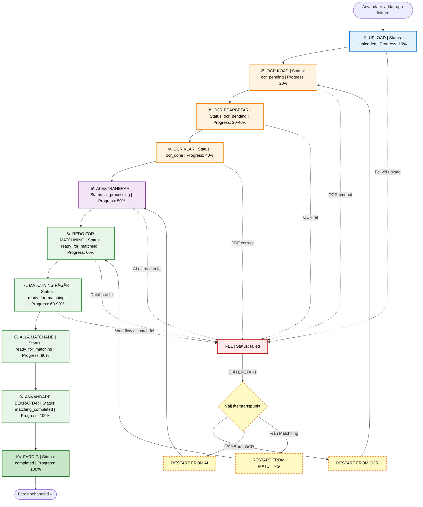

# FirstCard Status-flöde - Komplett Översikt

**Datum:** 2025-11-08  
**Syfte:** Dokumentera alla statusar som rapporteras under FirstCard invoice-processing

---

## 🎯 Sammanfattning

FirstCard-systemet använder **3 parallella state machines** för att spåra progress:

1. **`processing_status`** - Teknisk pipeline-status (8 statusar)
2. **`document_status`** - Business-facing status (6 statusar)  
3. **`match_status`** - Per-line matchningsstatus (6 statusar)

---

## 📊 Status Flow Diagram



### Status-översikt:

| Processing Status | Progress | Document Status | Beskrivning |
|-------------------|----------|-----------------|-------------|
| `uploaded` | 10% | `imported` | Initial upload klar |
| `ocr_pending` | 20-40% | `imported` | OCR bearbetar sidor |
| `ocr_done` | 40% | `imported` | Alla sidor OCR klara |
| `ai_processing` | 50% | `imported` | AI extraherar invoice lines |
| `ready_for_matching` | 60-90% | `matching` / `partially_matched` / `matched` | User matchar lines |
| `matching_completed` | 100% | `matched` | Alla lines bekräftade |
| `completed` | 100% | `completed` | Helt färdig |
| `failed` | - | - | Fel uppstod, kan startas om |

---

## 📝 Detaljerat Status-flöde (Steg-för-steg)

### **STEG 1: Upload** 
**Endpoint:** `POST /reconciliation/firstcard/upload-invoice`

| Kolumn | Värde | Beskrivning |
|--------|-------|-------------|
| `processing_status` | `uploaded` | Fil uppladdad, sparad i storage |
| `document_status` | `NULL` → `imported` | Initial business status |
| Workflow | Created | `workflow_runs` skapad |
| Frontend visar | "Laddar upp..." → "Bearbetar dokument" |

**Vad händer:**
- PDF/Image uppladdas
- `unified_files` record skapas
- `invoice_documents` skapas med `processing_status=uploaded`
- `workflow_run` skapas
- Workflow dispatchas

---

### **STEG 2: PDF Split (om multi-page PDF)**
**Celery Task:** `split_pdf_pages`

| Kolumn | Värde | Beskrivning |
|--------|-------|-------------|
| `processing_status` | `ocr_pending` | PDF delad i sidor, OCR startar |
| `document_status` | `imported` | Oförändrad |
| Page status | `uploaded` → `ocr_pending` | Per-page status |
| Frontend visar | "Bearbetar sidor (0/5 klara)" |

**Vad händer:**
- PDF konverteras till PNG per sida
- Varje sida får egen `unified_files` record
- `metadata.page_count` sätts
- OCR tasks köas för varje sida

---

### **STEG 3: OCR Processing**
**Celery Task:** `process_ocr_task` (körs per sida)

| Kolumn | Värde | Beskrivning |
|--------|-------|-------------|
| `processing_status` | `ocr_pending` | OCR pågår |
| Page status | `ocr_pending` → `ocr_done` | Per sida |
| Frontend visar | "OCR-bearbetar (3/5 sidor klara)" |

**Per-sida progress:**
- Sida 1: `ocr_pending` → `ocr_done` ✓
- Sida 2: `ocr_pending` → `ocr_done` ✓
- Sida 3: `ocr_pending` → `ocr_done` ✓
- ...

**När alla sidor klara:**

| Kolumn | Värde | Beskrivning |
|--------|-------|-------------|
| `processing_status` | `ocr_done` | **ALLA** sidor OCR klara |
| Frontend visar | "OCR klart - Extraherar transaktioner" |

---

### **STEG 4: AI Extraction**
**Celery Task:** `process_invoice_document`

| Kolumn | Värde | Beskrivning |
|--------|-------|-------------|
| `processing_status` | `ai_processing` | AI extraherar invoice lines |
| `document_status` | `imported` | Oförändrad |
| Frontend visar | "Extraherar transaktioner med AI..." |

**Vad händer:**
- Samlar all OCR-text från alla sidor
- Anropar AI för att extrahera:
  - Header info (period, total amount, etc)
  - Transaction lines (date, merchant, amount)
- Parsar AI-response till strukturerad data

---

### **STEG 5: Lines Inserted**
**After AI extraction:**

| Kolumn | Värde | Beskrivning |
|--------|-------|-------------|
| `processing_status` | `ready_for_matching` | Lines redo för matching |
| `document_status` | `imported` → `matching` | User kan börja matcha |
| Line `match_status` | `pending` | Alla lines initial status |
| Frontend visar | "Redo för matchning (0/47 matchade)" |

**Vad händer:**
- Transaction lines sparas i `invoice_lines` table
- Varje line får `match_status=pending`
- Auto-match körs (försöker matcha automatiskt)
- Frontend visar lista med lines

---

### **STEG 6: Auto-Matching** (Optional)
**Celery Task:** `auto_match_invoice_lines`

| Kolumn | Värde | Beskrivning |
|--------|-------|-------------|
| `processing_status` | `ready_for_matching` | Oförändrad |
| `document_status` | `matching` | User kan matcha |
| Line `match_status` | `pending` → `auto` | Per matchad line |
| Frontend visar | "Auto-matchning... (15/47 matchade)" |

**Per-line progress:**
- Line 1: `pending` → `auto` (matched receipt #123, score: 0.95) ✓
- Line 2: `pending` → `auto` (matched receipt #456, score: 0.87) ✓
- Line 3: `pending` (no match found - kvar)
- ...

---

### **STEG 7: User Matching**
**Frontend:** User matchar resterande lines manuellt

| Kolumn | Värde | Beskrivning |
|--------|-------|-------------|
| `processing_status` | `ready_for_matching` | Oförändrad |
| `document_status` | `matching` → `partially_matched` | När några matchade |
| Line `match_status` | `pending/auto` → `manual` | User matchar |
| Frontend visar | "Matchning pågår (32/47 matchade)" |

**User actions:**
- Click "Matcha" på line → `match_status=manual`
- Confirm auto-match → `match_status=confirmed`
- Mark as unmatched → `match_status=unmatched`

**Progress updates:**
```
20/47 matched → document_status=partially_matched
35/47 matched → document_status=partially_matched
47/47 matched → document_status=matched
```

---

### **STEG 8: All Lines Matched**
**Trigger:** När alla lines har status `auto|manual|confirmed`

| Kolumn | Värde | Beskrivning |
|--------|-------|-------------|
| `processing_status` | `matching_completed` | All lines matchade |
| `document_status` | `matched` | Business: alla matchade |
| Frontend visar | "Alla transaktioner matchade ✓" |

**Vad händer:**
- System detekterar att `matched_lines == total_lines`
- `WorkflowCoordinator.update_match_progress()` triggas
- Auto-transition till `matching_completed`

---

### **STEG 9: User Confirms**
**Endpoint:** `POST /reconciliation/firstcard/statements/<sid>/confirm`

| Kolumn | Värde | Beskrivning |
|--------|-------|-------------|
| `processing_status` | `completed` | Helt färdig |
| `document_status` | `completed` | Redo för export |
| Frontend visar | "Färdigbehandlad ✓ Redo för export" |

**Vad händer:**
- User klickar "Bekräfta & Slutför"
- Final validation
- Markeras som completed
- Kan nu exporteras till bokföringssystem

---

### **STEG 10: Error States**
**Vid fel någonstans i flödet:**

| Kolumn | Värde | Beskrivning |
|--------|-------|-------------|
| `processing_status` | `failed` | Processing-fel |
| `document_status` | `failed` | Business-fel |
| `metadata.error` | Error message | Felmeddelande |
| Frontend visar | "⚠️ Fel: [error message]" |

**Möjliga fel:**
- OCR timeout
- AI extraction failed
- Invalid PDF format
- Database error
- Workflow dispatch failed

**Recovery:**
- `POST /statements/<sid>/restart` → Starta om från början
- `POST /statements/<sid>/resume` → Fortsätt från senaste status

---

## 🔄 Parallella Statusar - Exempel

**Real-world exempel vid t.ex. 40% progress:**

```json
{
  "invoice_id": "abc-123",
  "processing_status": "ready_for_matching",  // Technical pipeline
  "document_status": "partially_matched",     // Business status
  "page_progress": {
    "total_pages": 5,
    "completed_pages": 5,
    "pages": [
      {"page": 1, "status": "ocr_done"},
      {"page": 2, "status": "ocr_done"},
      {"page": 3, "status": "ocr_done"},
      {"page": 4, "status": "ocr_done"},
      {"page": 5, "status": "ocr_done"}
    ]
  },
  "line_progress": {
    "total_lines": 47,
    "matched_lines": 19,
    "lines": [
      {"line_id": 1, "match_status": "auto", "matched_file_id": "receipt-1"},
      {"line_id": 2, "match_status": "manual", "matched_file_id": "receipt-2"},
      {"line_id": 3, "match_status": "pending", "matched_file_id": null},
      {"line_id": 4, "match_status": "confirmed", "matched_file_id": "receipt-3"},
      // ... 43 more lines
    ]
  }
}
```

---

## 📺 Frontend Status-visning

### Rekommenderad UI-mapping:

```javascript
// Map processing_status to user-friendly text
const statusText = {
  'uploaded': 'Uppladdad - Förbereder...',
  'ocr_pending': 'OCR-bearbetar dokument...',
  'ocr_done': 'OCR klart - Extraherar data...',
  'ai_processing': 'AI extraherar transaktioner...',
  'ready_for_matching': 'Redo för matchning',
  'matching_completed': 'Alla transaktioner matchade',
  'completed': 'Färdigbehandlad ✓',
  'failed': '⚠️ Fel uppstod'
}

// Progress percentage
function calculateProgress(invoice) {
  const stages = {
    'uploaded': 10,
    'ocr_pending': 20,
    'ocr_done': 40,
    'ai_processing': 50,
    'ready_for_matching': 60,
    'matching_completed': 90,
    'completed': 100
  }
  
  let baseProgress = stages[invoice.processing_status] || 0
  
  // Refine based on line matching progress
  if (invoice.processing_status === 'ready_for_matching') {
    const matchPercent = (invoice.matched_lines / invoice.total_lines) * 30
    return 60 + matchPercent  // 60-90%
  }
  
  return baseProgress
}
```

### Status Badge Colors:

| Status | Color | Icon |
|--------|-------|------|
| `uploaded`, `ocr_pending`, `ocr_done`, `ai_processing` | 🔵 Blue | ⏳ Processing |
| `ready_for_matching`, `partially_matched` | 🟡 Yellow | 🔄 In Progress |
| `matching_completed`, `matched` | 🟢 Light Green | ✓ Ready |
| `completed` | 🟢 Dark Green | ✅ Done |
| `failed` | 🔴 Red | ⚠️ Error |

---

## 🔔 Status-notifikationer (Real-time Updates)

### WebSocket/SSE Events:

```javascript
// Frontend lyssnar på dessa events
socket.on('invoice_status_update', (data) => {
  console.log(`Invoice ${data.invoice_id}:`)
  console.log(`  processing_status: ${data.processing_status}`)
  console.log(`  document_status: ${data.document_status}`)
  console.log(`  progress: ${data.progress}%`)
  
  // Update UI
  updateInvoiceCard(data.invoice_id, data)
})

socket.on('invoice_page_complete', (data) => {
  console.log(`Page ${data.page_number} OCR complete`)
  // Update progress bar
})

socket.on('invoice_line_matched', (data) => {
  console.log(`Line ${data.line_id} matched to ${data.receipt_id}`)
  // Update line in UI
})
```

### Backend Events att emittera:

```python
# I Workflow Coordinator:

def transition_to_ocr_complete(invoice_id):
    # ... transition logic ...
    
    # Emit event
    emit_status_update(invoice_id, {
        'processing_status': 'ocr_done',
        'message': 'OCR complete - Starting AI extraction',
        'progress': 40
    })

def update_match_progress(invoice_id):
    total, matched = # ... calculate ...
    
    # Emit event
    emit_status_update(invoice_id, {
        'processing_status': 'ready_for_matching',
        'document_status': 'partially_matched' if matched < total else 'matched',
        'total_lines': total,
        'matched_lines': matched,
        'progress': 60 + (matched / total * 30)
    })
```

---

## 📋 Status-kolumn i Databas

### `invoice_documents` table:

```sql
CREATE TABLE invoice_documents (
  id VARCHAR(36) PRIMARY KEY,
  
  -- Technical pipeline status (8 values)
  processing_status ENUM(
    'uploaded',
    'ocr_pending', 
    'ocr_done',
    'ai_processing',
    'ready_for_matching',
    'matching_completed',
    'completed',
    'failed'
  ) DEFAULT 'uploaded',
  
  -- Business status (6 values)
  document_status ENUM(
    'imported',
    'matching',
    'partially_matched',
    'matched',
    'completed',
    'failed'
  ) DEFAULT 'imported',
  
  -- Timestamps
  created_at TIMESTAMP DEFAULT CURRENT_TIMESTAMP,
  updated_at TIMESTAMP DEFAULT CURRENT_TIMESTAMP ON UPDATE CURRENT_TIMESTAMP,
  
  -- Metadata JSON
  metadata_json JSON,
  
  INDEX idx_processing_status (processing_status),
  INDEX idx_document_status (document_status)
)
```

### `invoice_lines` table:

```sql
CREATE TABLE invoice_lines (
  id INT AUTO_INCREMENT PRIMARY KEY,
  invoice_id VARCHAR(36),
  
  -- Line data
  transaction_date DATE,
  merchant_name VARCHAR(255),
  amount DECIMAL(10,2),
  
  -- Match status (6 values)
  match_status ENUM(
    'pending',
    'auto',
    'manual',
    'confirmed',
    'unmatched',
    'ignored'
  ) DEFAULT 'pending',
  
  -- Match reference
  matched_file_id VARCHAR(36),
  match_score DECIMAL(3,2),
  
  FOREIGN KEY (invoice_id) REFERENCES invoice_documents(id),
  INDEX idx_match_status (match_status)
)
```

---

## 🎯 API Response Format

### GET `/reconciliation/firstcard/invoices/<id>/status`

```json
{
  "invoice_id": "abc-123",
  "processing_status": "ready_for_matching",
  "document_status": "partially_matched",
  "created_at": "2025-11-08T10:00:00Z",
  "updated_at": "2025-11-08T10:15:23Z",
  
  "page_progress": {
    "total_pages": 5,
    "completed_pages": 5,
    "ocr_complete": true,
    "pages": [
      {
        "page_number": 1,
        "file_id": "page-1-id",
        "status": "ocr_done",
        "ocr_text_length": 2456
      },
      // ... 4 more pages
    ]
  },
  
  "line_progress": {
    "total_lines": 47,
    "matched_lines": 19,
    "pending_lines": 28,
    "match_percentage": 40.43,
    "breakdown": {
      "auto": 15,
      "manual": 4,
      "confirmed": 0,
      "pending": 28,
      "unmatched": 0,
      "ignored": 0
    }
  },
  
  "metadata": {
    "period_start": "2025-10-01",
    "period_end": "2025-10-31",
    "total_amount": "45678.90",
    "currency": "SEK",
    "creditcard_main_id": 123
  },
  
  "workflow": {
    "workflow_run_id": "wf-456",
    "current_stage": "matching",
    "status": "running"
  }
}
```

---

## 🚀 Next Steps

### Implementation Checklist:

- [ ] **Workflow Coordinator** implementerar status-transitions
- [ ] **Status-polling endpoint** optimerad med caching
- [ ] **WebSocket/SSE events** för real-time updates
- [ ] **Frontend status-display** mappning
- [ ] **Progress calculation** algoritm
- [ ] **Status-notifikationer** UI
- [ ] **Error recovery** UI (resume/restart)

### Testing:

- [ ] Test alla 8 processing_status transitions
- [ ] Test alla 6 document_status transitions
- [ ] Test concurrent line matching (race conditions)
- [ ] Test status polling performance (1000+ invoices)
- [ ] Test WebSocket event delivery
- [ ] Test error recovery flows

---

**Skapad:** 2025-11-08  
**Relaterade dokument:**
- `FIRSTCARD_WORKFLOW_PROBLEMS.md` - Workflow-problem & lösningar
- `REFACTORING_ANALYSIS_LARGE_FILES.md` - Refactoring-plan
