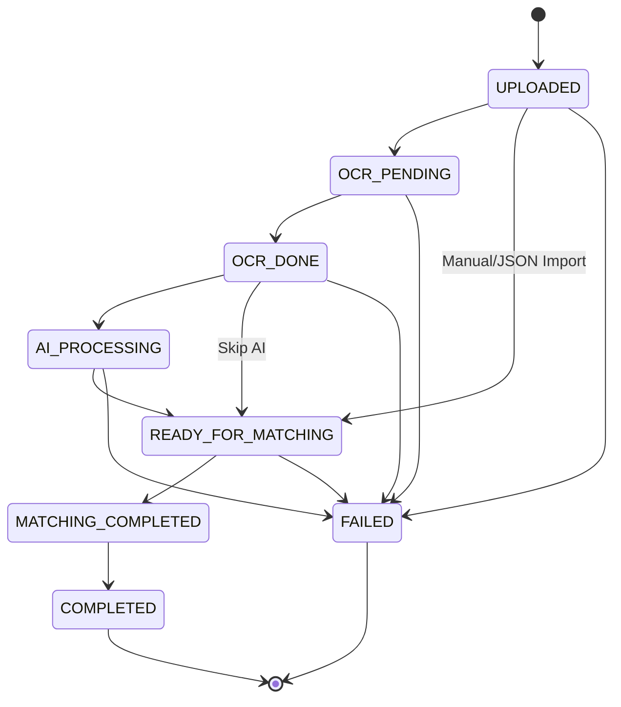
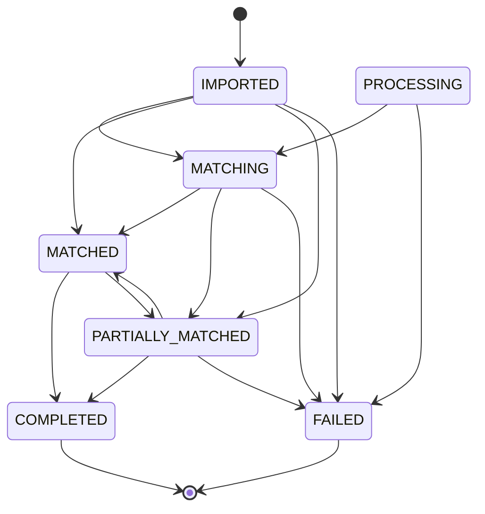
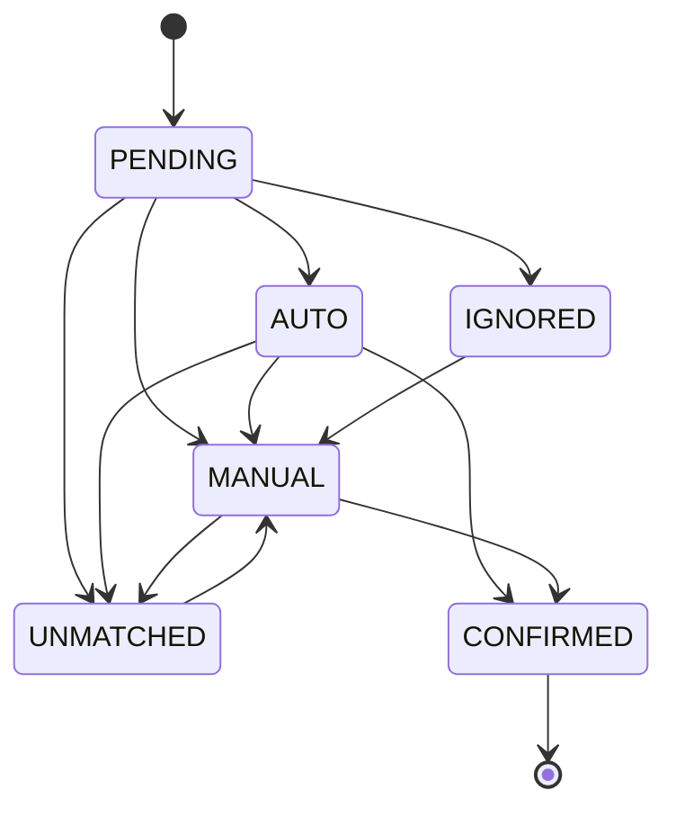

# Mind2 Status Transitions

**Version:** 1.0
**Date:** 2025-11-27
**Source:** `backend/src/services/invoice_status.py` & `backend/src/services/status_constants.py`

This document defines the allowed state transitions for invoice processing entities. These transitions are enforced by the backend state machine helpers.

## 1. Invoice Processing Status (`invoice_documents.processing_status`)

Tracks the technical processing pipeline.

### State Diagram

### Allowed Transitions

| Current State | Allowed Next States |
| :--- | :--- |
| `uploaded` | `ocr_pending`, `ready_for_matching`, `failed` |
| `ocr_pending` | `ocr_done`, `failed` |
| `ocr_done` | `ai_processing`, `ready_for_matching`, `failed` |
| `ai_processing` | `ready_for_matching`, `failed` |
| `ready_for_matching` | `matching_completed`, `failed` |
| `matching_completed` | `completed` |
| `completed` | *(none)* |
| `failed` | *(none)* |

---

## 2. Invoice Document Status (`invoice_documents.status`)

Tracks the business-facing lifecycle state.

### State Diagram

### Allowed Transitions

| Current State | Allowed Next States |
| :--- | :--- |
| `imported` | `matching`, `matched`, `partially_matched`, `failed` |
| `matching` | `matched`, `partially_matched`, `failed` |
| `matched` | `completed`, `partially_matched` |
| `partially_matched` | `matched`, `completed`, `failed` |
| `processing` | `matching`, `failed` |
| `completed` | *(none)* |
| `failed` | *(none)* |

---

## 3. Invoice Line Match Status (`invoice_lines.match_status`)

Tracks the reconciliation status of individual invoice lines.

### State Diagram

### Allowed Transitions

| Current State | Allowed Next States |
| :--- | :--- |
| `pending` | `auto`, `manual`, `unmatched`, `ignored` |
| `auto` | `manual`, `confirmed`, `unmatched` |
| `manual` | `confirmed`, `unmatched` |
| `confirmed` | *(none)* |
| `unmatched` | `manual` |
| `ignored` | `manual` |
