# Import- och Matchningsflöde

Detta diagram visar end-to-end-flödet för kvitton (WF1_RECEIPT) och FirstCard-fakturor (WF3_FIRSTCARD_INVOICE), inklusive källor, ingest, OCR/AI-steg, automatchning och utfall. Används som referens för felsökning och vidareutveckling.

```mermaid
%%{init: {'theme': 'base', 'themeVariables': {
  'primaryColor': '#E8F4FF',
  'lineColor': '#6b7280',
  'fontSize': '12px',
  'fontFamily': 'Inter, Segoe UI, Roboto, Arial'
}}}%%
flowchart TD
  %% Kända problem: process_ocr ignorerade tidigare workflow_type → FC hamnade i kvittoflöde

  %% ---------- Klassdefinitioner ----------
  classDef start fill:#FFF3CD,stroke:#FFA000,stroke-width:1px,color:#3b3b00; 
  classDef done  fill:#D4EDDA,stroke:#28A745,stroke-width:1px,color:#0f5132;
  classDef halt  fill:#F8D7DA,stroke:#DC3545,stroke-width:1px,color:#842029;

  subgraph SOURCES["Källor"]
    direction TB
    %% Källor + status
    src_portal_start["src_portal startad ⏳"]
    src_portal["Upload Portal (Process.jsx 'Ladda upp')"]
    src_portal_end["src_portal avslutad ✅"]

    src_ftp_start["src_ftp startad ⏳"]
    src_ftp["FTP (Process.jsx 'Hämta från FTP' -> /ai/api/ingest/fetch-ftp)"]
    src_ftp_end["src_ftp avslutad ✅"]

    src_fc_start["src_fc startad ⏳"]
    src_fc["FirstCard-uppladdning (CompanyCard.jsx -> /reconciliation/firstcard/upload-invoice)"]
    src_fc_end["src_fc avslutad ✅"]
  end

  subgraph INGEST["Ingest"]
    direction TB
    ingest_store_start["ingest_store startad ⏳"]
    ingest_store["Lagra fil + metadata\n(tabell: unified_files)\nSätt source_channel, company_id"]
    ingest_store_end["ingest_store avslutad ✅"]

    ingest_wf1_start["ingest_wf1 startad ⏳"]
    ingest_wf1["Skapa workflow_run: WF1_RECEIPT\n(för kvitton)"]
    ingest_wf1_end["ingest_wf1 avslutad ✅"]
  end

  subgraph FC_INGEST["FirstCard-fakturaflöde (WF3_FIRSTCARD_INVOICE)"]
    direction TB
    fc_create_start["fc_create startad ⏳"]
    fc_create["Skapa invoice_document (credit_card_invoice)"]
    fc_create_end["fc_create avslutad ✅"]

    fc_ocr_start["fc_ocr startad ⏳"]
    fc_ocr["OCR + sidextraktion"]
    fc_ocr_end["fc_ocr avslutad ✅"]

    fc_parse_start["fc_parse startad ⏳"]
    %% AI6 gör parse-steget
    fc_parse["AI6: Parsa fakturahuvud + rader\n(tabeller: creditcard_invoices_main, creditcard_invoice_items)"]
    fc_parse_end["fc_parse avslutad ✅"]

    %% Beslut: Är detta en FC-faktura?
    fc_is_fc{"FC-faktura?"}

    fc_ready_start["fc_ready startad ⏳"]
    fc_ready["Markera 'ready_for_matching'"]
    fc_ready_end["fc_ready avslutad ✅"]
  end

  subgraph RECEIPT_FLOW["Kvittoflöde (WF1_RECEIPT)"]
    direction TB
    detect_type_start["detect_type startad ⏳"]
    detect_type{"AI1: Dokumentklassning"}
    detect_type_end["detect_type avslutad ✅"]

    r_ocr_start["r_ocr startad ⏳"]
    r_ocr["OCR"]
    r_ocr_end["r_ocr avslutad ✅"]

    r_ai3_start["r_ai3 startad ⏳"]
    r_ai3["AI3: Dataextraktion (belopp, datum, merchant)"]
    r_ai3_end["r_ai3 avslutad ✅"]

    r_ai4_start["r_ai4 startad ⏳"]
    r_ai4["AI4: Normalisering/validering"]
    r_ai4_end["r_ai4 avslutad ✅"]

    r_persist_start["r_persist startad ⏳"]
    r_persist["Spara strukturerad data\n(unified_files + derivat)"]
    r_persist_end["r_persist avslutad ✅"]

    r_queue_match_start["r_queue_match startad ⏳"]
    r_queue_match["Köa för kortmatchning"]
    r_queue_match_end["r_queue_match avslutad ✅"]
  end

  %% Separat stoppunkt för manuell granskning
  subgraph MANUAL_REVIEW["Manuell granskning (stoppunkt)"]
    direction TB
    manual_review["manual_review 🚩"]
  end
  class manual_review halt

  subgraph MATCHING["Automatchning (AI5)"]
    direction TB
    ai5_start["ai5 startad ⏳"]
    ai5["AI5: Kortmatchning kvitto ↔ FC-fakturarad"]
    ai5_end["ai5 avslutad ✅"]

    m_found{"Match hittad?"}

    m_link_start["m_link startad ⏳"]
    m_link["Länka kvitto till fakturarad\n(unified_files.credit_card_match=1)"]
    m_link_end["m_link avslutad ✅"]

    m_unmatched_start["m_unmatched startad ⏳"]
    m_unmatched["Flagga som 'unmatched' för manuell hantering"]
    m_unmatched_end["m_unmatched avslutad ✅"]
  end

  subgraph OUTCOMES["Utfall"]
    direction TB
    finalize_ok_start["finalize_ok startad ⏳"]
    finalize_ok["Finalize: lyckades"]
    finalize_ok_end["finalize_ok avslutad ✅"]

    finalize_fail_start["finalize_fail startad ⏳"]
    finalize_fail["Finalize: misslyckades/kräver åtgärd"]
    finalize_fail_end["finalize_fail avslutad ✅"]

    KLAR["KLAR ✅"]
  end

  %% Flöden med statusnoder infogade
  %% Källor -> Ingest
  src_portal_start --> src_portal --> src_portal_end --> ingest_store_start
  src_ftp_start --> src_ftp --> src_ftp_end --> ingest_store_start

  ingest_store_start --> ingest_store --> ingest_store_end --> ingest_wf1_start
  ingest_wf1_start --> ingest_wf1 --> ingest_wf1_end --> detect_type_start

  %% FC-ingest
  src_fc_start --> src_fc --> src_fc_end --> fc_create_start
  fc_create_start --> fc_create --> fc_create_end --> fc_ocr_start
  fc_ocr_start --> fc_ocr --> fc_ocr_end --> fc_parse_start
  fc_parse_start --> fc_parse --> fc_parse_end --> fc_is_fc
  fc_is_fc -->|ja| fc_ready_start
  fc_is_fc -->|nej| manual_review
  fc_ready_start --> fc_ready --> fc_ready_end --> ai5_start

  %% Kvittoflöde
  detect_type_start --> detect_type --> detect_type_end
  detect_type -->|kvitto| r_ocr_start
  %% Tidig stoppregel: ej kvitto/ej FC-faktura → manual_review
  detect_type -->|faktura ej FC| manual_review
  detect_type -->|annat| manual_review

  r_ocr_start --> r_ocr --> r_ocr_end --> r_ai3_start
  r_ai3_start --> r_ai3 --> r_ai3_end --> r_ai4_start
  r_ai4_start --> r_ai4 --> r_ai4_end --> r_persist_start
  r_persist_start --> r_persist --> r_persist_end --> r_queue_match_start
  r_queue_match_start --> r_queue_match --> r_queue_match_end --> ai5_start

  %% Matchning
  ai5_start --> ai5 --> ai5_end --> m_found
  m_found -->|ja| m_link_start
  m_link_start --> m_link --> m_link_end --> finalize_ok_start
  m_found -->|nej| m_unmatched_start
  m_unmatched_start --> m_unmatched --> m_unmatched_end --> finalize_fail_start

  %% Utfall och slut
  finalize_ok_start --> finalize_ok --> finalize_ok_end --> KLAR

  %% ---------- Klassapplicering ----------
  class src_portal_start,src_ftp_start,src_fc_start,ingest_store_start,ingest_wf1_start,fc_create_start,fc_ocr_start,fc_parse_start,fc_ready_start,detect_type_start,r_ocr_start,r_ai3_start,r_ai4_start,r_persist_start,r_queue_match_start,ai5_start,m_link_start,m_unmatched_start,finalize_ok_start,finalize_fail_start start;
  class src_portal_end,src_ftp_end,src_fc_end,ingest_store_end,ingest_wf1_end,fc_create_end,fc_ocr_end,fc_parse_end,fc_ready_end,detect_type_end,r_ocr_end,r_ai3_end,r_ai4_end,r_persist_end,r_queue_match_end,ai5_end,m_link_end,m_unmatched_end,finalize_ok_end,finalize_fail_end,KLAR done;

```

