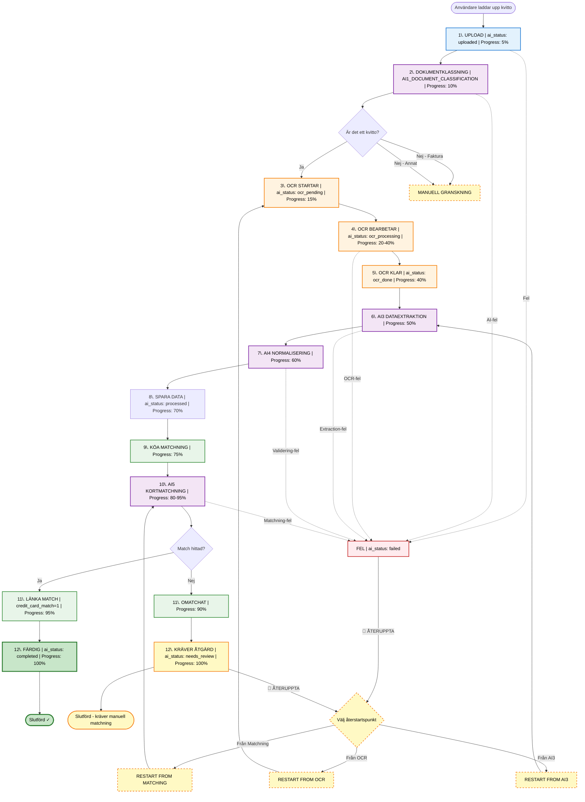

# Kvittoinläsning (WF1_RECEIPT) - Komplett Status-flöde

**Datum:** 2025-11-08  
**Syfte:** Dokumentera alla statusar, loggning och UI-förbättringar för kvittoinläsning

---

## 🎯 Sammanfattning

Kvittosystemet använder **workflow-baserad processing** med följande komponenter:

1. **`ai_status`** - AI-processing pipeline status (10+ statusar)
2. **`workflow_runs`** - Workflow execution tracking
3. **`workflow_stage_runs`** - Per-stage status och logging
4. **Loggning** - Komplett AI-dialog + workflow-steg
5. **Preview Modal** - Navigation + företagssökning

---

## 📊 Status Flow Diagram



---

## 📝 Detaljerat Status-flöde (Steg-för-steg)

### **STEG 1: Upload**
**Endpoint:** `POST /ai/api/ingest/upload` (från Process.jsx)

| Kolumn | Värde | Beskrivning |
|--------|-------|-------------|
| `ai_status` | `uploaded` | Fil uppladdad, sparad i storage |
| `workflow_type` | `receipt` | Markerar som kvitto |
| Workflow | Created | `workflow_runs` skapas med `WF1_RECEIPT` |
| Stage | `INGEST` | Initial stage |
| Frontend visar | "Laddar upp..." → "Bearbetar kvitto" |

**Vad händer:**
- Bild/PDF uppladdas
- `unified_files` record skapas
- `workflow_run` skapas med `workflow_key=WF1_RECEIPT`
- Workflow dispatchas

---

### **STEG 2: Dokumentklassning (AI1)**
**Celery Task:** `classify_document_task`
**Stage:** `AI1_DOCUMENT_CLASSIFICATION`

| Kolumn | Värde | Beskrivning |
|--------|-------|-------------|
| `ai_status` | `classifying` | AI1 analyserar dokumenttyp |
| `workflow_stage` | `AI1_DOCUMENT_CLASSIFICATION` | Current stage |
| Stage status | `running` | Stage pågår |
| Frontend visar | "Klassificerar dokument..." |

**Vad händer:**
- AI1 analyserar bild
- Identifierar: kvitto, faktura, eller annat
- Sparar klassning i `other_data.document_type`
- Loggar AI-dialog (prompt + response)

**Beslutspunkt:**
- **Kvitto** → Fortsätt till OCR
- **Faktura (ej FC)** → Manual review
- **Annat** → Manual review

---

### **STEG 3-5: OCR Processing**
**Celery Task:** `process_ocr_task`
**Stage:** `OCR`

| Steg | ai_status | workflow_stage | Progress | Beskrivning |
|------|-----------|----------------|----------|-------------|
| 3 | `ocr_pending` | `OCR` | 15% | OCR köad |
| 4 | `ocr_processing` | `OCR` | 20-40% | OCR bearbetar |
| 5 | `ocr_done` | `OCR` | 40% | OCR klar |

**Vad händer:**
- OCR-motor (Tesseract/Google Vision) extraherar text
- Sparar raw OCR-text i `ocr_raw`
- Loggar OCR-resultat
- Frontend visar progress per sida (om multi-page)

---

### **STEG 6: AI3 Dataextraktion**
**Celery Task:** `extract_receipt_data_task`
**Stage:** `AI3_DATA_EXTRACTION`

| Kolumn | Värde | Beskrivning |
|--------|-------|-------------|
| `ai_status` | `extracting` | AI3 extraherar strukturerad data |
| `workflow_stage` | `AI3_DATA_EXTRACTION` | Current stage |
| Frontend visar | "Extraherar data från kvitto..." |

**Vad händer:**
- AI3 analyserar OCR-text
- Extraherar:
  - `merchant_name` (merchant/företag)
  - `total_amount` (belopp)
  - `purchase_date` (datum)
  - `line_items` (radposter)
  - `vat_amount` (moms)
- Sparar extraherad data i `other_data`
- **Loggar komplett AI-dialog**:
  - System prompt
  - OCR-text input
  - AI response (JSON)
  - Parsing errors (om några)

---

### **STEG 7: AI4 Normalisering**
**Celery Task:** `normalize_receipt_data_task`
**Stage:** `AI4_NORMALIZATION`

| Kolumn | Värde | Beskrivning |
|--------|-------|-------------|
| `ai_status` | `normalizing` | AI4 validerar och normaliserar |
| `workflow_stage` | `AI4_NORMALIZATION` | Current stage |
| Frontend visar | "Validerar och strukturerar data..." |

**Vad händer:**
- AI4 validerar extraherad data
- Normaliserar format:
  - Datum → ISO 8601
  - Belopp → Decimal med 2 decimaler
  - Valutor → SEK/EUR/USD
- Beräknar konfidenspoäng
- Sparar i `ai_confidence`
- **Loggar valideringsfel och korrigeringar**

---

### **STEG 8: Spara strukturerad data**
**Celery Task:** `persist_receipt_data_task`
**Stage:** `PERSIST_DATA`

| Kolumn | Värde | Beskrivning |
|--------|-------|-------------|
| `ai_status` | `processed` | Data strukturerad och sparad |
| `workflow_stage` | `PERSIST_DATA` | Current stage |
| Frontend visar | "Sparar kvittodata..." |

**Vad händer:**
- Uppdaterar `unified_files` med final data:
  - `merchant_name`
  - `net_amount_sek`
  - `gross_amount_sek`
  - `purchase_date`
- Sparar line items i separat JSON-fil
- Skapar `accounting_proposals` (bokföringförslag)

---

### **STEG 9: Köa för matchning**
**Stage:** `QUEUE_MATCHING`

| Kolumn | Värde | Beskrivning |
|--------|-------|-------------|
| `ai_status` | `ready_for_matching` | Redo för kortmatchning |
| `workflow_stage` | `QUEUE_MATCHING` | Current stage |
| Frontend visar | "Förbereder kortmatchning..." |

**Vad händer:**
- Hämtar relevanta FirstCard-fakturarader
- Filtrerar på:
  - Datum (±3 dagar från purchase_date)
  - Belopp (±5% tolerans)
- Köar AI5-matchning

---

### **STEG 10: AI5 Kortmatchning**
**Celery Task:** `match_receipt_to_card_task`
**Stage:** `AI5_CARD_MATCHING`

| Kolumn | Värde | Beskrivning |
|--------|-------|-------------|
| `ai_status` | `matching` | AI5 matchar mot FirstCard |
| `workflow_stage` | `AI5_CARD_MATCHING` | Current stage |
| Frontend visar | "Matchar mot kortfaktura..." |

**Vad händer:**
- AI5 jämför kvitto mot FirstCard-rader
- Bedömer match-sannolikhet per rad
- Beräknar match-score (0-100%)
- **Loggar matchningslogik**:
  - Kandidat-rader (top 5)
  - Score-beräkning
  - Beslut (match/ej match)
  - Confidence level

**Match-kriterier:**
- Datum matchar (±3 dagar)
- Belopp matchar (±5%)
- Merchant name similarity >70%

---

### **STEG 11-12: Finalisering**

#### **11a. Match hittad**

| Kolumn | Värde | Beskrivning |
|--------|-------|-------------|
| `ai_status` | `matched` | Matchad mot FirstCard |
| `credit_card_match` | `1` | Markerar som matchad |
| `workflow_stage` | `FINALIZE` | Final stage |
| Frontend visar | "Matchad ✓" |

**Vad händer:**
- Länka `unified_files.id` → `creditcard_invoice_items.matched_receipt_id`
- Sätt `credit_card_match=1`
- Sätt `ai_status=completed`
- Workflow: `status=completed`

#### **11b. Ingen match**

| Kolumn | Värde | Beskrivning |
|--------|-------|-------------|
| `ai_status` | `needs_review` | Kräver manuell matchning |
| `credit_card_match` | `0` | Omatchat |
| `workflow_stage` | `FINALIZE` | Final stage |
| Frontend visar | "Kräver manuell matchning ⚠️" |

**Vad händer:**
- Flagga för manuell granskning
- Workflow: `status=completed` (men med varning)
- Användaren kan manuellt matcha i UI

---

### **Felhantering**

**Vid fel i något steg:**

| Kolumn | Värde | Beskrivning |
|--------|-------|-------------|
| `ai_status` | `failed` | Processing-fel |
| `workflow_stage` | (där felet inträffade) | T.ex. `AI3_DATA_EXTRACTION` |
| Stage status | `failed` | Stage misslyckades |
| `workflow_runs.status` | `failed` | Workflow failed |
| Frontend visar | "⚠️ Fel: [error message]" |

**Möjliga fel:**
- OCR timeout (bild för suddig)
- AI3 extraction failed (inget belopp hittades)
- AI4 validation failed (ogiltigt datum)
- AI5 matching timeout
- Database error

**Recovery:**
- `POST /ai/api/ingest/process/{id}/resume` → Återuppta från senaste stage
- User kan välja återstartspunkt i UI

---

## 🔔 Loggning - Komplett AI-dialog

### **Loggstruktur**

Varje kvitto har **komplett logghistorik** som inkluderar:

1. **Workflow Runs** - All workflow-exekveringar
2. **Workflow Stages** - Per-stage status och timing
3. **AI History** - Komplett AI-dialog (prompt + response)
4. **Files** - Relaterade filer (original + derivatives)

### **Backend Endpoint**

**GET `/ai/api/receipts/{rid}/log`**

**Response:**
```json
{
  "receipt_id": "abc-123",
  "workflow_runs": [
    {
      "id": "wr-456",
      "workflow_key": "WF1_RECEIPT",
      "status": "completed",
      "current_stage": "FINALIZE",
      "source_channel": "portal_upload",
      "created_at": "2025-11-08T10:00:00Z",
      "updated_at": "2025-11-08T10:05:23Z",
      "stages": [
        {
          "stage_key": "INGEST",
          "status": "completed",
          "started_at": "2025-11-08T10:00:00Z",
          "finished_at": "2025-11-08T10:00:02Z",
          "duration_ms": 2000,
          "message": "File uploaded successfully"
        },
        {
          "stage_key": "AI1_DOCUMENT_CLASSIFICATION",
          "status": "completed",
          "started_at": "2025-11-08T10:00:02Z",
          "finished_at": "2025-11-08T10:00:05Z",
          "duration_ms": 3000,
          "message": "Classified as: receipt (confidence: 0.95)"
        },
        {
          "stage_key": "OCR",
          "status": "completed",
          "started_at": "2025-11-08T10:00:05Z",
          "finished_at": "2025-11-08T10:01:20Z",
          "duration_ms": 75000,
          "message": "OCR completed: 2456 characters extracted"
        },
        {
          "stage_key": "AI3_DATA_EXTRACTION",
          "status": "completed",
          "started_at": "2025-11-08T10:01:20Z",
          "finished_at": "2025-11-08T10:01:35Z",
          "duration_ms": 15000,
          "message": "Extracted: merchant, amount, date, 5 line items"
        },
        {
          "stage_key": "AI4_NORMALIZATION",
          "status": "completed",
          "started_at": "2025-11-08T10:01:35Z",
          "finished_at": "2025-11-08T10:01:40Z",
          "duration_ms": 5000,
          "message": "Validation passed, confidence: 0.89"
        },
        {
          "stage_key": "AI5_CARD_MATCHING",
          "status": "completed",
          "started_at": "2025-11-08T10:01:40Z",
          "finished_at": "2025-11-08T10:05:20Z",
          "duration_ms": 220000,
          "message": "Matched to invoice line #4567 (score: 92%)"
        },
        {
          "stage_key": "FINALIZE",
          "status": "completed",
          "started_at": "2025-11-08T10:05:20Z",
          "finished_at": "2025-11-08T10:05:23Z",
          "duration_ms": 3000,
          "message": "Receipt completed successfully"
        }
      ]
    }
  ],
  "ai_history": [
    {
      "id": "ai-1",
      "stage": "AI1_DOCUMENT_CLASSIFICATION",
      "model": "gpt-4",
      "prompt": "Classify this document: [image]",
      "response": "{\"document_type\": \"receipt\", \"confidence\": 0.95}",
      "tokens_used": 150,
      "cost": 0.0045,
      "timestamp": "2025-11-08T10:00:02Z"
    },
    {
      "id": "ai-2",
      "stage": "AI3_DATA_EXTRACTION",
      "model": "gpt-4",
      "prompt": "Extract structured data from this receipt OCR text:\n\nICA SUPERMARKET\nStorgatan 1\n...",
      "response": "{\"merchant_name\": \"ICA SUPERMARKET\", \"total_amount\": 456.50, ...}",
      "tokens_used": 2500,
      "cost": 0.075,
      "timestamp": "2025-11-08T10:01:20Z"
    },
    {
      "id": "ai-3",
      "stage": "AI5_CARD_MATCHING",
      "model": "gpt-4",
      "prompt": "Match this receipt to one of these FirstCard transactions:\n1. ICA SUPERMARKET 455.00 2025-11-07\n2. COOP 123.50 2025-11-08\n...",
      "response": "{\"match_id\": 1, \"confidence\": 0.92, \"reasoning\": \"Date and amount match within tolerance\"}",
      "tokens_used": 800,
      "cost": 0.024,
      "timestamp": "2025-11-08T10:01:40Z"
    }
  ],
  "files": [
    {
      "id": "abc-123",
      "file_type": "receipt_image",
      "workflow_type": "receipt",
      "ai_status": "completed",
      "ai_confidence": 0.89,
      "created_at": "2025-11-08T10:00:00Z",
      "updated_at": "2025-11-08T10:05:23Z",
      "ocr_raw_length": 2456
    }
  ],
  "metadata": {
    "total_cost": 0.1035,
    "total_duration_ms": 323000,
    "total_ai_calls": 3
  }
}
```

---

## 📺 Frontend - Log Modal

### **Nuvarande Implementation (Process.jsx)**

**Finns redan:**
- `renderLogModal()` - Visar workflow + stages
- Endpoint: `GET /ai/api/receipts/{rid}/log`
- Visar workflow runs + stages med timing

**SAKNAS - Behöver läggas till:**

### **1. Komplett AI-dialog i modal**

**Lägg till i `renderLogModal()`:**

```jsx
// Efter workflow stages-sektion
<section>
  <div className="flex items-center justify-between gap-3">
    <h4 className="text-sm font-semibold text-gray-200 uppercase tracking-wide">
      AI-dialog (Komplett)
    </h4>
    <span className="text-xs text-gray-500">
      {aiHistory.length ? `${aiHistory.length} st` : 'Ingen AI-historik'}
    </span>
  </div>
  {aiHistory.length === 0 ? (
    <p className="text-xs text-gray-400 mt-2">Ingen AI-dialog loggad för detta kvitto.</p>
  ) : (
    <div className="mt-3 space-y-3">
      {aiHistory.map((ai, index) => (
        <div key={ai.id || index} className="bg-gray-900 border border-gray-700 rounded-lg p-4 space-y-3">
          <div className="flex flex-wrap items-start justify-between gap-2">
            <div>
              <div className="text-sm font-semibold text-gray-100">
                {ai.stage} · {ai.model}
              </div>
              <div className="text-xs text-gray-400">
                Tokens: {ai.tokens_used} · Kostnad: {ai.cost} SEK
              </div>
            </div>
            <div className="text-xs text-gray-400">
              {formatDate(ai.timestamp, true)}
            </div>
          </div>
          
          {/* Prompt */}
          <div className="space-y-1">
            <div className="text-xs font-medium text-blue-400">Prompt till AI:</div>
            <pre className="text-xs text-gray-300 whitespace-pre-wrap font-mono bg-gray-800/50 p-2 rounded max-h-40 overflow-y-auto">
              {ai.prompt}
            </pre>
          </div>
          
          {/* Response */}
          <div className="space-y-1">
            <div className="text-xs font-medium text-green-400">AI Response:</div>
            <pre className="text-xs text-gray-300 whitespace-pre-wrap font-mono bg-gray-800/50 p-2 rounded max-h-40 overflow-y-auto">
              {typeof ai.response === 'string' ? ai.response : JSON.stringify(ai.response, null, 2)}
            </pre>
          </div>
        </div>
      ))}
    </div>
  )}
</section>
```

### **2. "Visa samtliga loggar" - Länk till separat sida**

**Lägg till överst i modal header:**

```jsx
<div className="modal-header">
  <div>
    <div className="flex items-center gap-3">
      <h3>Bearbetningslogg</h3>
      <a 
        href={`/receipts/${receiptIdForModal}/logs`} 
        target="_blank"
        rel="noopener noreferrer"
        className="text-xs text-blue-400 hover:text-blue-300 underline flex items-center gap-1"
      >
        <FiExternalLink className="w-3 h-3" />
        Visa samtliga loggar
      </a>
    </div>
    <p className="text-xs text-gray-400 mt-1">
      Kvitto: {receiptIdForModal || 'okänt'}
    </p>
  </div>
  <button type="button" className="icon-button" onClick={closeLogViewer} aria-label="Stäng logg">
    <FiX />
  </button>
</div>
```

**Ny sida:** `ReceiptLogsPage.jsx`

```jsx
import React, { useState, useEffect } from 'react';
import { useParams } from 'react-router-dom';
import { api } from '../api';

export default function ReceiptLogsPage() {
  const { receiptId } = useParams();
  const [logs, setLogs] = useState(null);
  const [loading, setLoading] = useState(true);

  useEffect(() => {
    fetchLogs();
  }, [receiptId]);

  async function fetchLogs() {
    try {
      const res = await api.fetch(`/ai/api/receipts/${receiptId}/log`);
      const data = await res.json();
      setLogs(data);
    } catch (error) {
      console.error('Failed to fetch logs:', error);
    } finally {
      setLoading(false);
    }
  }

  if (loading) {
    return <div className="loading-spinner">Hämtar loggar...</div>;
  }

  return (
    <div className="container mx-auto px-4 py-8">
      <h1 className="text-2xl font-bold mb-6">
        Samtliga loggar för kvitto {receiptId}
      </h1>
      
      {/* Visa all workflow runs */}
      {logs?.workflow_runs?.map(run => (
        <WorkflowRunCard key={run.id} run={run} />
      ))}
      
      {/* Visa all AI-historik */}
      <h2 className="text-xl font-bold mt-8 mb-4">AI-historik</h2>
      {logs?.ai_history?.map((ai, idx) => (
        <AIHistoryCard key={ai.id || idx} ai={ai} />
      ))}
    </div>
  );
}
```

---

## 🖼️ Preview Modal - Förbättringar

### **Nuvarande Implementation (ReceiptPreviewModal.jsx)**

**Finns redan:**
- Visar kvittobild med OCR-överlag
- Editerbara fält (merchant, amount, date, etc.)
- Line items-tabell
- Sparar ändringar till backend

**SAKNAS - Behöver läggas till:**

### **1. Navigation (Föregående/Nästa kvitto)**

**Lägg till i modal header:**

```jsx
<div className="modal-header flex items-center justify-between">
  {/* Previous button */}
  <button
    type="button"
    className="icon-button"
    onClick={onNavigatePrevious}
    disabled={!hasPrevious}
    aria-label="Föregående kvitto"
  >
    <FiChevronLeft className="w-5 h-5" />
  </button>

  <div className="flex-1 text-center">
    <h3>Kvitto {currentIndex + 1} av {totalReceipts}</h3>
    <p className="text-xs text-gray-400 mt-1">ID: {receiptId}</p>
  </div>

  {/* Next button */}
  <button
    type="button"
    className="icon-button"
    onClick={onNavigateNext}
    disabled={!hasNext}
    aria-label="Nästa kvitto"
  >
    <FiChevronRight className="w-5 h-5" />
  </button>

  {/* Close button */}
  <button type="button" className="icon-button ml-4" onClick={onClose} aria-label="Stäng">
    <FiX />
  </button>
</div>
```

**Props som behövs:**

```jsx
function ReceiptPreviewModal({
  receiptId,
  onClose,
  // NYA PROPS:
  receipts = [],           // Array med alla kvitto-IDs i current view
  currentIndex = 0,        // Index för current receipt
  onNavigatePrevious,      // Callback för föregående
  onNavigateNext,          // Callback för nästa
}) {
  const hasPrevious = currentIndex > 0;
  const hasNext = currentIndex < receipts.length - 1;
  const totalReceipts = receipts.length;
  
  // ... rest of component
}
```

**Implementation i Process.jsx:**

```jsx
function Process() {
  const [previewState, setPreviewState] = useState({
    open: false,
    receiptId: null,
    receipts: [],      // All receipt IDs in current filtered view
    currentIndex: 0,
  });

  function openPreview(receiptId) {
    const receipts = filteredReceipts.map(r => r.id);
    const currentIndex = receipts.indexOf(receiptId);
    
    setPreviewState({
      open: true,
      receiptId,
      receipts,
      currentIndex,
    });
  }

  function navigatePrevious() {
    const newIndex = previewState.currentIndex - 1;
    if (newIndex >= 0) {
      setPreviewState(prev => ({
        ...prev,
        currentIndex: newIndex,
        receiptId: prev.receipts[newIndex],
      }));
    }
  }

  function navigateNext() {
    const newIndex = previewState.currentIndex + 1;
    if (newIndex < previewState.receipts.length) {
      setPreviewState(prev => ({
        ...prev,
        currentIndex: newIndex,
        receiptId: prev.receipts[newIndex],
      }));
    }
  }

  return (
    <>
      {/* ... rest of component */}
      
      <ReceiptPreviewModal
        receiptId={previewState.receiptId}
        open={previewState.open}
        onClose={() => setPreviewState({ ...previewState, open: false })}
        receipts={previewState.receipts}
        currentIndex={previewState.currentIndex}
        onNavigatePrevious={navigatePrevious}
        onNavigateNext={navigateNext}
      />
    </>
  );
}
```

**Keyboard shortcuts:**

```jsx
useEffect(() => {
  function handleKeydown(event) {
    if (!open) return;
    
    if (event.key === 'ArrowLeft' && hasPrevious) {
      onNavigatePrevious();
    } else if (event.key === 'ArrowRight' && hasNext) {
      onNavigateNext();
    } else if (event.key === 'Escape') {
      onClose();
    }
  }
  
  window.addEventListener('keydown', handleKeydown);
  return () => window.removeEventListener('keydown', handleKeydown);
}, [open, hasPrevious, hasNext, onNavigatePrevious, onNavigateNext, onClose]);
```

---

### **2. Företag - Sökbar dropdown + "Lägg till nytt företag"**

**Nuvarande:** Text input för företagsnamn

**NYTT:** Searchable dropdown med companies-tabellen + "Lägg till"-knapp

#### **a) Hämta companies från backend**

**Nytt endpoint:** `GET /ai/api/companies`

```python
# backend/src/api/companies.py

@companies_bp.get("/companies")
def list_companies():
    """Return all companies for dropdown."""
    if db_cursor is None:
        return jsonify([]), 200
    
    try:
        with db_cursor() as cur:
            cur.execute("""
                SELECT 
                    id,
                    name,
                    orgnr,
                    address,
                    created_at,
                    updated_at
                FROM companies
                WHERE is_active = 1
                ORDER BY name ASC
            """)
            rows = cur.fetchall() or []
    except Exception as e:
        logger.error(f"Failed to fetch companies: {e}")
        return jsonify([]), 500
    
    companies = []
    for (company_id, name, orgnr, address, created_at, updated_at) in rows:
        companies.append({
            'id': company_id,
            'name': name,
            'orgnr': orgnr,
            'address': address,
            'created_at': created_at.isoformat() if created_at else None,
            'updated_at': updated_at.isoformat() if updated_at else None,
        })
    
    return jsonify(companies), 200


@companies_bp.post("/companies")
def create_company():
    """Create a new company."""
    data = request.get_json() or {}
    name = (data.get('name') or '').strip()
    orgnr = (data.get('orgnr') or '').strip()
    address = (data.get('address') or '').strip()
    
    if not name:
        return jsonify({'error': 'Company name is required'}), 400
    
    if db_cursor is None:
        return jsonify({'error': 'Database not available'}), 500
    
    try:
        with db_cursor() as cur:
            cur.execute("""
                INSERT INTO companies (name, orgnr, address, is_active, created_at, updated_at)
                VALUES (%s, %s, %s, 1, NOW(), NOW())
            """, (name, orgnr, address))
            
            company_id = cur.lastrowid
            
        return jsonify({
            'id': company_id,
            'name': name,
            'orgnr': orgnr,
            'address': address,
        }), 201
    except Exception as e:
        logger.error(f"Failed to create company: {e}")
        return jsonify({'error': 'Failed to create company'}), 500
```

#### **b) CompanySelect-komponent (ny)**

```jsx
// components/CompanySelect.jsx

import React, { useState, useEffect, useRef } from 'react';
import { FiSearch, FiPlus, FiCheck } from 'react-icons/fi';
import { api } from '../api';

export default function CompanySelect({ 
  value,           // Selected company object or null
  onChange,        // (company) => void
  onCreateNew,     // () => void - öppnar modal
}) {
  const [companies, setCompanies] = useState([]);
  const [loading, setLoading] = useState(true);
  const [search, setSearch] = useState('');
  const [isOpen, setIsOpen] = useState(false);
  const dropdownRef = useRef(null);

  useEffect(() => {
    fetchCompanies();
  }, []);

  useEffect(() => {
    function handleClickOutside(event) {
      if (dropdownRef.current && !dropdownRef.current.contains(event.target)) {
        setIsOpen(false);
      }
    }
    document.addEventListener('mousedown', handleClickOutside);
    return () => document.removeEventListener('mousedown', handleClickOutside);
  }, []);

  async function fetchCompanies() {
    try {
      const res = await api.fetch('/ai/api/companies');
      const data = await res.json();
      setCompanies(data);
    } catch (error) {
      console.error('Failed to fetch companies:', error);
    } finally {
      setLoading(false);
    }
  }

  const filteredCompanies = companies.filter(company =>
    company.name.toLowerCase().includes(search.toLowerCase()) ||
    (company.orgnr || '').includes(search)
  );

  function handleSelect(company) {
    onChange(company);
    setIsOpen(false);
    setSearch('');
  }

  return (
    <div className="relative" ref={dropdownRef}>
      {/* Selected value display */}
      <button
        type="button"
        className="input-field w-full text-left flex items-center justify-between"
        onClick={() => setIsOpen(!isOpen)}
      >
        <span className={value ? 'text-gray-100' : 'text-gray-500'}>
          {value?.name || 'Välj företag...'}
        </span>
        <FiSearch className="w-4 h-4 text-gray-400" />
      </button>

      {/* Dropdown */}
      {isOpen && (
        <div className="absolute z-50 mt-1 w-full bg-gray-800 border border-gray-700 rounded-lg shadow-lg max-h-80 overflow-hidden">
          {/* Search input */}
          <div className="p-2 border-b border-gray-700">
            <input
              type="text"
              className="input-field w-full"
              placeholder="Sök företag..."
              value={search}
              onChange={(e) => setSearch(e.target.value)}
              autoFocus
            />
          </div>

          {/* Companies list */}
          <div className="overflow-y-auto max-h-60">
            {loading ? (
              <div className="p-4 text-center text-gray-400">Laddar...</div>
            ) : filteredCompanies.length === 0 ? (
              <div className="p-4 text-center text-gray-400">Inga företag hittades</div>
            ) : (
              filteredCompanies.map(company => (
                <button
                  key={company.id}
                  type="button"
                  className="w-full px-4 py-2 text-left hover:bg-gray-700 flex items-center justify-between"
                  onClick={() => handleSelect(company)}
                >
                  <div>
                    <div className="text-sm font-medium text-gray-100">{company.name}</div>
                    {company.orgnr && (
                      <div className="text-xs text-gray-400">Org.nr: {company.orgnr}</div>
                    )}
                  </div>
                  {value?.id === company.id && (
                    <FiCheck className="w-4 h-4 text-green-400" />
                  )}
                </button>
              ))
            )}
          </div>

          {/* Add new button */}
          <div className="p-2 border-t border-gray-700">
            <button
              type="button"
              className="btn-secondary w-full flex items-center justify-center gap-2"
              onClick={() => {
                setIsOpen(false);
                onCreateNew();
              }}
            >
              <FiPlus className="w-4 h-4" />
              Lägg till nytt företag
            </button>
          </div>
        </div>
      )}
    </div>
  );
}
```

#### **c) AddCompanyModal (ny)**

```jsx
// components/AddCompanyModal.jsx

import React, { useState } from 'react';
import { FiX, FiSave } from 'react-icons/fi';
import { api } from '../api';

export default function AddCompanyModal({ open, onClose, onCompanyCreated }) {
  const [formData, setFormData] = useState({
    name: '',
    orgnr: '',
    address: '',
  });
  const [saving, setSaving] = useState(false);
  const [error, setError] = useState(null);

  function handleChange(field, value) {
    setFormData(prev => ({ ...prev, [field]: value }));
    setError(null);
  }

  async function handleSave() {
    if (!formData.name.trim()) {
      setError('Företagsnamn är obligatoriskt');
      return;
    }

    setSaving(true);
    setError(null);

    try {
      const res = await api.fetch('/ai/api/companies', {
        method: 'POST',
        headers: { 'Content-Type': 'application/json' },
        body: JSON.stringify(formData),
      });

      if (!res.ok) {
        const data = await res.json();
        throw new Error(data.error || 'Failed to create company');
      }

      const newCompany = await res.json();
      
      // Reset form
      setFormData({ name: '', orgnr: '', address: '' });
      
      // Notify parent
      onCompanyCreated(newCompany);
      
      // Close modal
      onClose();
    } catch (err) {
      setError(err.message);
    } finally {
      setSaving(false);
    }
  }

  if (!open) return null;

  return (
    <div className="modal-backdrop" onClick={(e) => e.target === e.currentTarget && onClose()}>
      <div className="modal" style={{ maxWidth: '500px' }}>
        <div className="modal-header">
          <h3>Lägg till nytt företag</h3>
          <button type="button" className="icon-button" onClick={onClose}>
            <FiX />
          </button>
        </div>

        <div className="modal-body space-y-4">
          {error && (
            <div className="alert alert-error">{error}</div>
          )}

          <div>
            <label className="label">Företagsnamn *</label>
            <input
              type="text"
              className="input-field"
              value={formData.name}
              onChange={(e) => handleChange('name', e.target.value)}
              placeholder="T.ex. ICA SUPERMARKET"
            />
          </div>

          <div>
            <label className="label">Organisationsnummer</label>
            <input
              type="text"
              className="input-field"
              value={formData.orgnr}
              onChange={(e) => handleChange('orgnr', e.target.value)}
              placeholder="T.ex. 556001-2345"
            />
          </div>

          <div>
            <label className="label">Adress</label>
            <textarea
              className="input-field"
              rows="3"
              value={formData.address}
              onChange={(e) => handleChange('address', e.target.value)}
              placeholder="T.ex. Storgatan 1, 12345 Stockholm"
            />
          </div>
        </div>

        <div className="modal-footer">
          <button type="button" className="btn-secondary" onClick={onClose}>
            Avbryt
          </button>
          <button
            type="button"
            className="btn-primary flex items-center gap-2"
            onClick={handleSave}
            disabled={saving}
          >
            {saving ? (
              <>
                <div className="loading-spinner w-4 h-4" />
                Sparar...
              </>
            ) : (
              <>
                <FiSave />
                Spara företag
              </>
            )}
          </button>
        </div>
      </div>
    </div>
  );
}
```

#### **d) Integration i ReceiptPreviewModal**

```jsx
// ReceiptPreviewModal.jsx - uppdatera "Företag"-fältet

import CompanySelect from './CompanySelect';
import AddCompanyModal from './AddCompanyModal';

function ReceiptPreviewModal({ ... }) {
  const [showAddCompanyModal, setShowAddCompanyModal] = useState(false);
  const [selectedCompany, setSelectedCompany] = useState(null);

  useEffect(() => {
    // Set initial company from receipt data
    if (receiptData?.company) {
      setSelectedCompany({
        id: receiptData.company.id,
        name: receiptData.company.name,
        orgnr: receiptData.company.orgnr,
        address: receiptData.company.address,
      });
    }
  }, [receiptData]);

  function handleCompanyChange(company) {
    setSelectedCompany(company);
    // Update local state
    setFormData(prev => ({
      ...prev,
      company: {
        id: company.id,
        name: company.name,
        orgnr: company.orgnr,
        address: company.address,
      }
    }));
  }

  function handleCompanyCreated(newCompany) {
    // Automatically select the newly created company
    handleCompanyChange(newCompany);
  }

  return (
    <>
      <div className="modal-body">
        {/* ... other fields ... */}

        {/* Replace old text input with CompanySelect */}
        <div>
          <label className="label">Företag</label>
          <CompanySelect
            value={selectedCompany}
            onChange={handleCompanyChange}
            onCreateNew={() => setShowAddCompanyModal(true)}
          />
        </div>

        {/* ... rest of fields ... */}
      </div>

      {/* Add Company Modal */}
      <AddCompanyModal
        open={showAddCompanyModal}
        onClose={() => setShowAddCompanyModal(false)}
        onCompanyCreated={handleCompanyCreated}
      />
    </>
  );
}
```

---

## 📋 Refactoring Checklist

### **Backend (receipts.py)**

- [ ] **Loggning**:
  - [ ] Logga AI1 prompt + response i `ai_history` table
  - [ ] Logga AI3 extraction prompt + response
  - [ ] Logga AI4 normalization changes
  - [ ] Logga AI5 matching logic (kandidater + score)
  - [ ] Spara tokens_used + cost per AI-call

- [ ] **Status tracking**:
  - [ ] Implementera progress-beräkning (0-100%)
  - [ ] WebSocket/SSE events för real-time updates
  - [ ] Uppdatera `workflow_stage_runs` med timing + message

- [ ] **Companies API**:
  - [ ] Skapa `companies.py` blueprint
  - [ ] `GET /companies` - Lista alla företag
  - [ ] `POST /companies` - Skapa nytt företag
  - [ ] `PUT /companies/{id}` - Uppdatera företag

### **Frontend (Process.jsx + ReceiptPreviewModal.jsx)**

- [ ] **Log Modal**:
  - [ ] Lägg till AI-dialog-sektion i `renderLogModal()`
  - [ ] Visa prompt + response för varje AI-call
  - [ ] Lägg till "Visa samtliga loggar"-länk i header
  - [ ] Skapa `ReceiptLogsPage.jsx` för full log-view

- [ ] **Preview Modal - Navigation**:
  - [ ] Lägg till föregående/nästa-knappar i header
  - [ ] Implementera `navigatePrevious()` / `navigateNext()` i Process.jsx
  - [ ] Keyboard shortcuts (Arrow Left/Right)
  - [ ] Visa "X av Y" i header

- [ ] **Preview Modal - Företagsval**:
  - [ ] Skapa `CompanySelect.jsx` komponent
  - [ ] Skapa `AddCompanyModal.jsx` komponent
  - [ ] Ersätt text input med CompanySelect
  - [ ] Hämta companies från backend
  - [ ] Implementera search/filter i dropdown
  - [ ] Auto-select nyskapat företag

### **Database**

- [ ] **ai_history table** (om den inte finns):
```sql
CREATE TABLE ai_history (
  id INT AUTO_INCREMENT PRIMARY KEY,
  file_id VARCHAR(36),
  stage VARCHAR(50),
  model VARCHAR(50),
  prompt TEXT,
  response TEXT,
  tokens_used INT,
  cost DECIMAL(10,4),
  created_at TIMESTAMP DEFAULT CURRENT_TIMESTAMP,
  INDEX idx_file_id (file_id),
  INDEX idx_stage (stage),
  FOREIGN KEY (file_id) REFERENCES unified_files(id)
);
```

- [ ] **companies table updates**:
```sql
ALTER TABLE companies 
ADD COLUMN is_active TINYINT(1) DEFAULT 1,
ADD COLUMN created_at TIMESTAMP DEFAULT CURRENT_TIMESTAMP,
ADD COLUMN updated_at TIMESTAMP DEFAULT CURRENT_TIMESTAMP ON UPDATE CURRENT_TIMESTAMP;
```

---

## 🎯 API Endpoints Summary

### **Kvitto-endpoints (existing)**

| Endpoint | Method | Beskrivning |
|----------|--------|-------------|
| `/ai/api/receipts` | GET | Lista kvitton med filter |
| `/ai/api/receipts/{rid}` | GET | Hämta enskilt kvitto |
| `/ai/api/receipts/{rid}/modal` | GET | Hämta kvitto för preview modal |
| `/ai/api/receipts/{rid}/modal` | PUT | Uppdatera kvitto från modal |
| `/ai/api/receipts/{rid}/log` | GET | Hämta workflow + AI-loggar |
| `/ai/api/receipts/{rid}/ai-history` | GET | Hämta AI-historik |
| `/ai/api/receipts/{rid}/workflow-status` | GET | Hämta workflow-status |
| `/ai/api/ingest/process/{rid}/resume` | POST | Återuppta bearbetning |

### **Nya endpoints som behövs**

| Endpoint | Method | Beskrivning |
|----------|--------|-------------|
| `/ai/api/companies` | GET | Lista alla företag för dropdown |
| `/ai/api/companies` | POST | Skapa nytt företag |
| `/ai/api/companies/{id}` | PUT | Uppdatera företag |
| `/ai/api/receipts/{rid}/logs` | GET | Full log-sida (kan använda samma som `/log`) |

---

## 📊 Progress Calculation

```python
def calculate_receipt_progress(ai_status, workflow_stage):
    """Calculate progress percentage (0-100) based on current status."""
    
    progress_map = {
        'uploaded': 5,
        'classifying': 10,
        'ocr_pending': 15,
        'ocr_processing': 30,  # Incremental per page
        'ocr_done': 40,
        'extracting': 50,
        'normalizing': 60,
        'processed': 70,
        'ready_for_matching': 75,
        'matching': 85,  # Incremental per match attempt
        'matched': 95,
        'completed': 100,
        'needs_review': 90,
        'failed': None,  # Keep last known progress
    }
    
    return progress_map.get(ai_status, 0)
```

---

## 🚀 Implementation Timeline

### **Vecka 1: Loggning**
- [ ] Dag 1-2: Implementera AI-dialog logging (backend)
- [ ] Dag 3-4: Uppdatera Log Modal (frontend)
- [ ] Dag 5: Skapa ReceiptLogsPage.jsx

### **Vecka 2: Preview Modal - Navigation**
- [ ] Dag 1-2: Implementera navigation i Process.jsx
- [ ] Dag 3-4: Uppdatera ReceiptPreviewModal med navigation
- [ ] Dag 5: Keyboard shortcuts + polish

### **Vecka 3: Preview Modal - Företagsval**
- [ ] Dag 1-2: Skapa companies API (backend)
- [ ] Dag 3-4: Skapa CompanySelect + AddCompanyModal (frontend)
- [ ] Dag 5: Integration i ReceiptPreviewModal

### **Vecka 4: Testing & Polish**
- [ ] Dag 1-2: E2E testing av loggning
- [ ] Dag 3-4: E2E testing av navigation + företagsval
- [ ] Dag 5: Bug fixes + dokumentation

---

**Skapad:** 2025-11-08  
**Relaterade dokument:**
- `FIRSTCARD_STATUS_FLOW.md` - FirstCard-statusflöde
- `MIND_PROCESS_IMPORT_STATUS_DIAGRAM.md` - Översiktsdiagram
- `REFACTORING_ANALYSIS_LARGE_FILES.md` - Refactoring-plan
