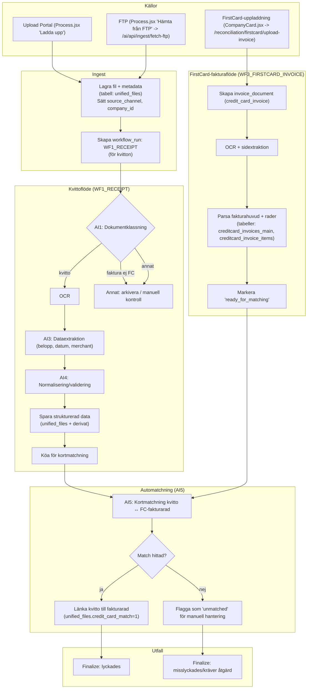

```mermaid
flowchart TD

  subgraph SOURCES["Källor"]
    direction TB
    src_portal["Upload Portal (Process.jsx 'Ladda upp')"]
    src_ftp["FTP (Process.jsx 'Hämta från FTP' -> /ai/api/ingest/fetch-ftp)"]
    src_fc["FirstCard-uppladdning (CompanyCard.jsx -> /reconciliation/firstcard/upload-invoice)"]
  end

  subgraph INGEST["Ingest"]
    direction TB
    ingest_store["Lagra fil + metadata\n(tabell: unified_files)\nSätt source_channel, company_id"]
    ingest_wf1["Skapa workflow_run: WF1_RECEIPT\n(för kvitton)"]
  end

  subgraph FC_INGEST["FirstCard-fakturaflöde (WF3_FIRSTCARD_INVOICE)"]
    direction TB
    fc_create["Skapa invoice_document (credit_card_invoice)"]
    fc_ocr["OCR + sidextraktion"]
    fc_parse["Parsa fakturahuvud + rader\n(tabeller: creditcard_invoices_main, creditcard_invoice_items)"]
    fc_ready["Markera 'ready_for_matching'"]
  end

  subgraph RECEIPT_FLOW["Kvittoflöde (WF1_RECEIPT)"]
    direction TB
    detect_type{"AI1: Dokumentklassning"}
    r_ocr["OCR"]
    r_ai3["AI3: Dataextraktion (belopp, datum, merchant)"]
    r_ai4["AI4: Normalisering/validering"]
    r_persist["Spara strukturerad data\n(unified_files + derivat)"]
    r_queue_match["Köa för kortmatchning"]
    r_other["Annat: arkivera / manuell kontroll"]
  end

  subgraph MATCHING["Automatchning (AI5)"]
    direction TB
    ai5["AI5: Kortmatchning kvitto ↔ FC-fakturarad"]
    m_found{"Match hittad?"}
    m_link["Länka kvitto till fakturarad\n(unified_files.credit_card_match=1)"]
    m_unmatched["Flagga som 'unmatched' för manuell hantering"]
  end

  subgraph OUTCOMES["Utfall"]
    direction TB
    finalize_ok["Finalize: lyckades"]
    finalize_fail["Finalize: misslyckades/kräver åtgärd"]
  end
  src_portal --> ingest_store
  src_ftp --> ingest_store
  ingest_store --> ingest_wf1
  ingest_wf1 --> detect_type

  src_fc --> fc_create
  fc_create --> fc_ocr --> fc_parse --> fc_ready

  detect_type -->|kvitto| r_ocr --> r_ai3 --> r_ai4 --> r_persist --> r_queue_match
  detect_type -->|faktura ej FC| r_other
  detect_type -->|annat| r_other

  r_queue_match --> ai5
  fc_ready --> ai5

  ai5 --> m_found
  m_found -->|ja| m_link --> finalize_ok
  m_found -->|nej| m_unmatched --> finalize_fail
```