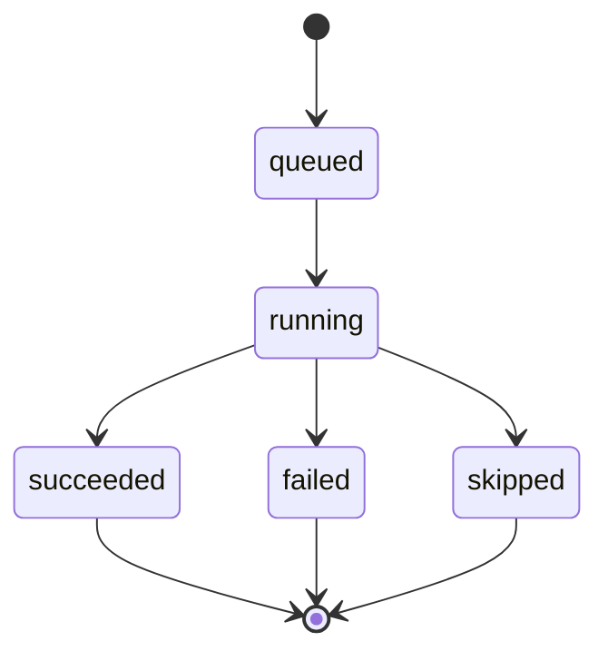
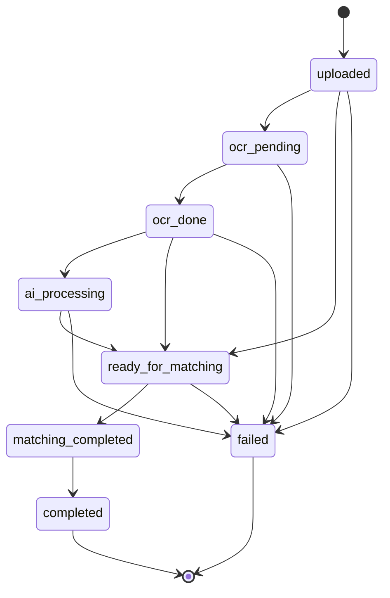
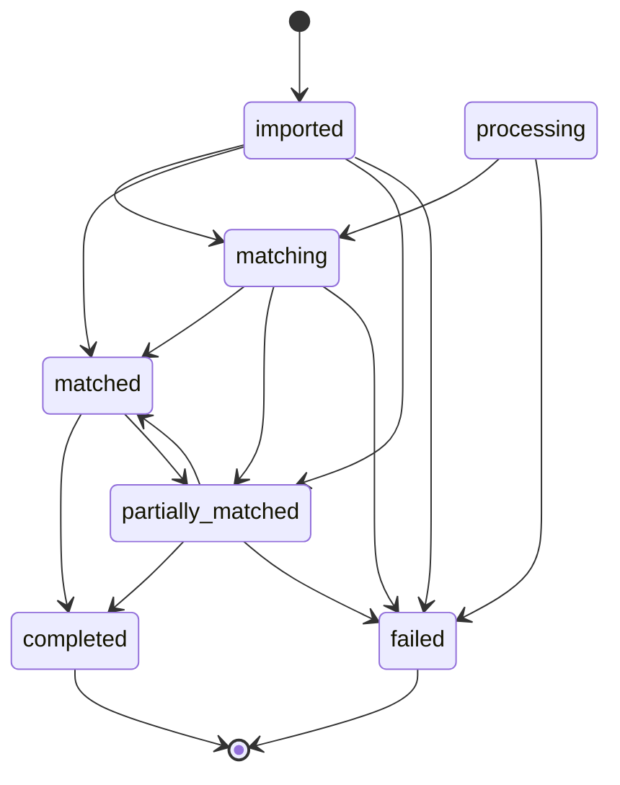
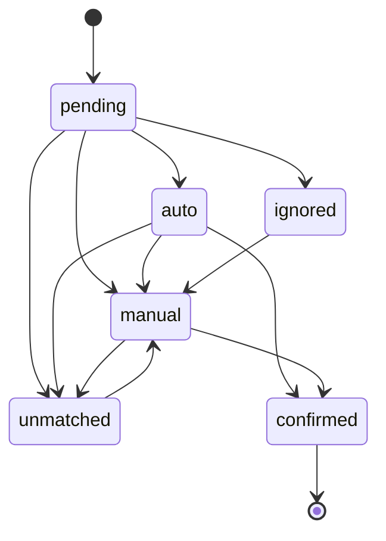

# Status Model – Source of Truth

Version: 2025-11-28  
Scope: Enumerations and legal transitions used across workflows. Mirrors `backend/src/services/status_constants.py` and `backend/src/services/invoice_status.py` plus workflow stage logging.

## AI / File Status (`unified_files.ai_status`)
| Value | Meaning | Writer(s) | Source |
| --- | --- | --- | --- |
| `uploaded` | File created, no processing yet. | `create_unified_file` default | `status_constants.AiStatus` |
| `processing` | Active pipeline step running. | `begin_import_stage` when stage_base in `src_portal/src_ftp/src_fc`; manual updates via `set_ai_status`. | `workflow_base.py` |
| `ocr_done` | OCR text persisted. | Not currently set explicitly; OCR tasks update other fields. | (enum only) |
| `ocr_failed` | OCR failed. | (enum only; not set in current tasks) |  |
| `manual_review` | Sent to manual review queue. | `_move_to_manual_review` in AI pipeline. | `ai_pipeline_tasks.py` |
| `completed` | Workflow finished successfully. | `complete_import_stage` when `stage_base="finalize_ok"`. | `workflow_base.py` |
| `failed` | Fatal error. | Error handlers / finalize_fail helpers. | `workflow_base.py` |

## Workflow Runs (`workflow_runs`, `workflow_stage_runs`)
- Tables created in `database/migrations/0042_create_workflow_tracking.sql`.
- Fields:
  - `workflow_runs.status`: `queued|running|succeeded|failed|canceled`
  - `workflow_stage_runs.stage_key`, `status`, `started_at`, `finished_at`, `message`
- Writers:
  - `mark_stage`, `begin_import_stage`, `complete_import_stage` (start/end + boundary rows like `src_portal_start`).
  - `wf1_finalize` / `wf2_finalize` set `workflow_runs.status`.
  - `FirstCardWorkflowCoordinator` methods (`begin_fc_import_stage`, `complete_fc_import_stage`).

### Workflow Stage Lifecycle (Mermaid)

## Invoice Processing Status (`invoice_documents.processing_status`)
Source: `services/status_constants.py` & `services/invoice_status.py`.

## Invoice Document Status (`invoice_documents.status`)

## Invoice Line Match Status (`invoice_lines.match_status`)

## Decision Points & Logs
- **WF1 (receipts):** stage keys `detect_type`, `r_ocr`, `r_ai3`, `r_ai4`, `r_persist`, `r_queue_match`, `ai_pipeline`, `finalize`, `finalize_ok`, `finalize_fail`, `KLAR`.
- **WF2 (PDF split/invoices):** `prepare_pages`, `page_ocr`, `merge_ocr`, `invoice_analysis`, `finalize`.
- **WF3 (FirstCard):** `firstcard_invoice`, `fc_ocr`, `ocr_merge`, `fc_parse`, `fc_ready`, `auto_match`, `ai5`, `m_found`, `m_link`, `m_unmatched`, `finalize_ok`, `KLAR`.
- **Resume/Restart:** `resume_dispatch`, `restart_dispatch` logged via `log_import_event` in API routes.

## How to Inspect Statuses
- Latest stage per file (used by UI): `SELECT CONCAT(stage_key,' ',status) FROM workflow_stage_runs WHERE workflow_run_id=? ORDER BY started_at DESC LIMIT 1;`
- Processing assertions: `services/invoice_status.transition_*` use `WHERE current_state IN (...)` to guard transitions and emit `observability.metrics.record_invoice_state_assertion` when blocked.

## Compatibility Notes
- Legacy task flow in `services/tasks/legacy.py` bypasses workflow_runs; keep separate when analyzing historical data.
- Ensure DB charset UTF-8 (`utf8mb4_0900_ai_ci`) as set in migration; required for Swedish characters per `docs/SWEDISH_ENCODING_RULES.md`.
