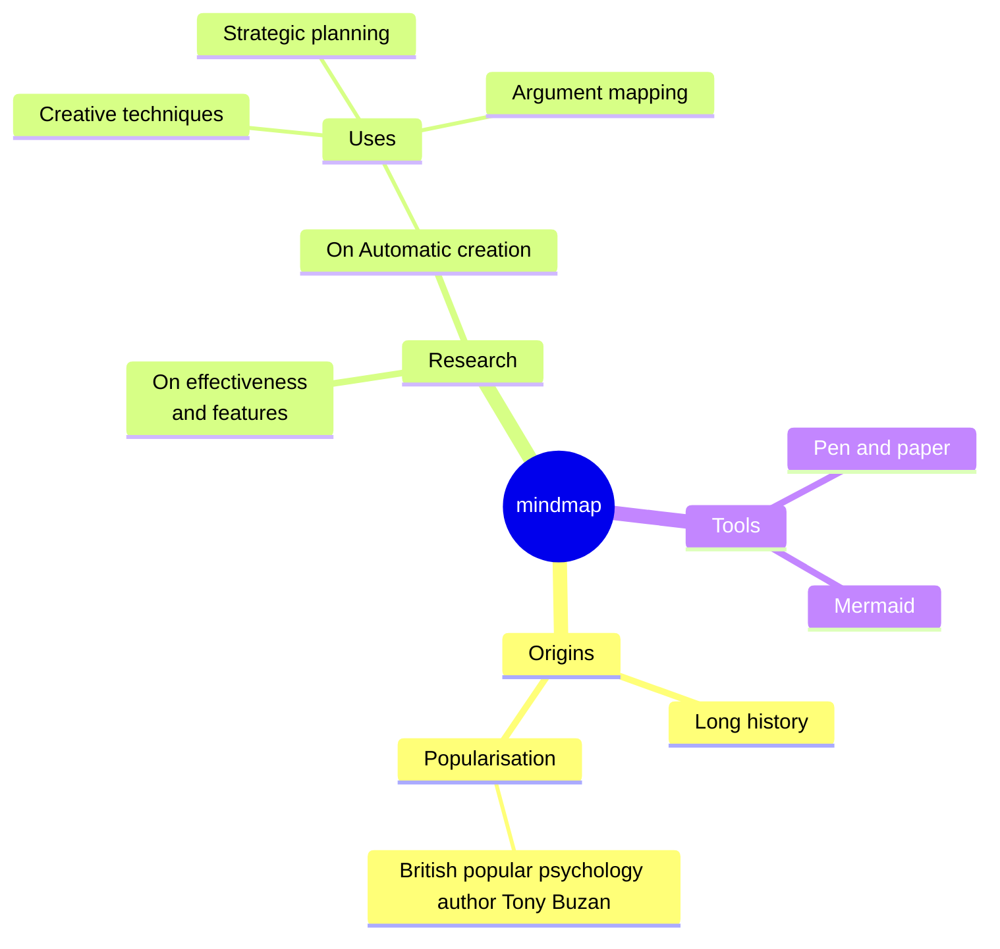

~~~gfm
```flow
st=>start: Start
op=>operation: Your Operation
cond=>condition: Yes or No?
e=>end

st->op->cond
cond(yes)->e
cond(no)->op
```
~~~


```
:root {  --mermaid-theme: default; */\*or base, dark, forest, neutral, night \*/*  --mermaid-font-family: "trebuchet ms", verdana, arial, sans-serif;  --mermaid-sequence-numbers: off; */\* or "on", see https://mermaid-js.github.io/mermaid/#/sequenceDiagram?id=sequencenumbers\*/*  --mermaid-flowchart-curve: linear */\* or "basis", see https://github.com/typora/typora-issues/issues/1632\*/*;  --mermaid--gantt-left-padding: 75; */\* see https://github.com/typora/typora-issues/issues/1665\*/* }
```


~~~sequence
```sequence
Alice->Bob: Hello Bob, how are you?
Note right of Bob: Bob thinks
Bob-->Alice: I am good thanks!
```
~~~


