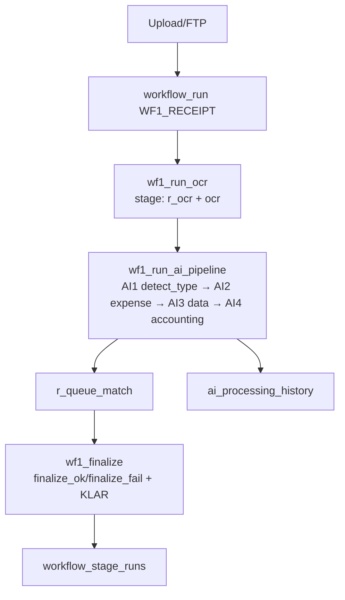
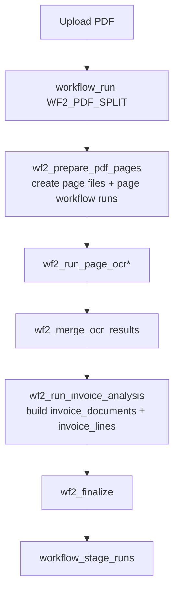
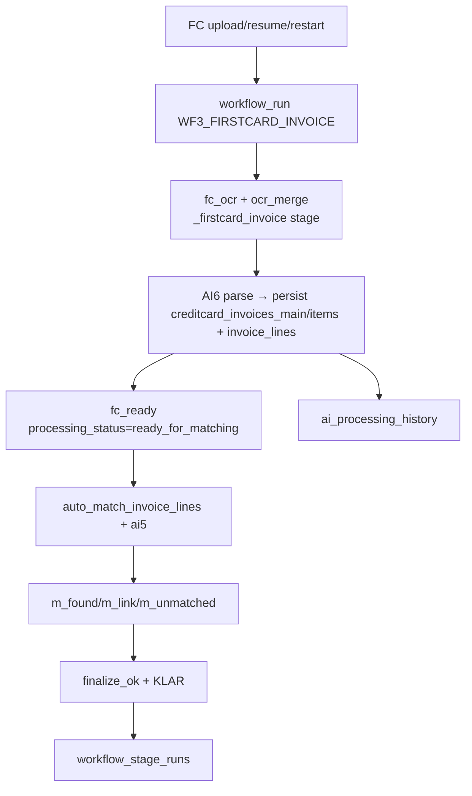

# Workflow Summary (WF1 / WF2 / WF3 / ManualMatch)

Version: 2025-11-28  
Goal: Fast orientation per workflow with entrypoints, stages, outputs, and references.

## Snapshot Table
| Workflow | Trigger | Primary stages | Outputs | Key code |
| --- | --- | --- | --- | --- |
| WF1_RECEIPT | `/ingest/upload` (image/pdf), FTP fetch | `dispatch → r_ocr → ocr → ai_pipeline (detect_type, r_ai3, r_ai4, r_persist, r_queue_match) → finalize_ok → KLAR` | `unified_files.ocr_raw`, AI3 data, accounting proposals, `workflow_runs/stage_runs` | `backend/src/api/ingest.py`, `services/tasks/ocr_tasks.py`, `services/tasks/ai_pipeline_tasks.py`, `services/tasks/workflow_tasks.py` |
| WF2_PDF_SPLIT | `/ingest/upload` (PDF) | `dispatch → prepare_pages → page_ocr* → merge_ocr → invoice_analysis → finalize` | Per-page `unified_files`, merged OCR text, `invoice_documents`/`invoice_lines`, stage logs | `services/tasks/ocr_tasks.py`, `services/tasks/workflow_tasks.py` |
| WF3_FIRSTCARD_INVOICE | `/reconciliation/firstcard/upload-invoice`, resume/restart routes | `firstcard_invoice → fc_ocr → ocr_merge → fc_parse (AI6) → fc_ready → auto_match/ai5 → m_found/m_link/m_unmatched → finalize_ok → KLAR` | `creditcard_invoices_main` + `_items`, `invoice_lines`, match state, stage logs | `services/workflow_coordinator.py`, `services/tasks/workflow_tasks.py`, `services/tasks/creditcard_tasks.py`, `services/ai_service.py` |
| ManualMatch | UI in `ManualMatch.jsx` fetching FC data | Fetch statements, invoice detail/lines, receipts; POST match/confirm endpoints | Updates `invoice_lines.match_status`, links receipts, toasts/pagination | `main-system/app-frontend/src/ui/pages/ManualMatch.jsx`, backend routes under `api/reconciliation_firstcard/routes/` |

## WF1 Receipt Diagram


## WF2 PDF Split Diagram


## WF3 FirstCard Diagram


## ManualMatch Flow (UI)
```mermaid
flowchart TD
  User --> List[GET /reconciliation/firstcard/statements]
  List --> Detail[GET /reconciliation/firstcard/statements/{id}]
  Detail --> Lines[GET /reconciliation/firstcard/statements/{id}/lines]
  Detail --> Receipts[GET /receipts?creditcard_invoice_id=...]
  Lines --> Match[POST /reconciliation/firstcard/match]
  Lines --> Confirm[POST /reconciliation/firstcard/statements/{id}/confirm]
```

## What to check when debugging
- `workflow_runs/current_stage` and latest `workflow_stage_runs` row for the file.
- `ai_processing_history` rows for AI1–AI6 + AI5 matching.
- Invoice statuses via `invoice_documents.processing_status` and `invoice_documents.status` (transition helpers in `services/invoice_status.py`).
- FirstCard metadata in `invoice_documents.metadata_json` (period, summary, line counts).

## References
- Status definitions: `docs/MIND_STATUS_DEFINITIONS.md`, `docs/SYSTEM_DOCS/STATUS_MODEL.md`.
- Task inventory: `docs/SYSTEM_DOCS/TASK_INVENTORY.md`.
- Implementation guides: `docs/features/implementation_guides/MIND_FULL_UPDATE_2025-11-26_PHASE_*.md`.
