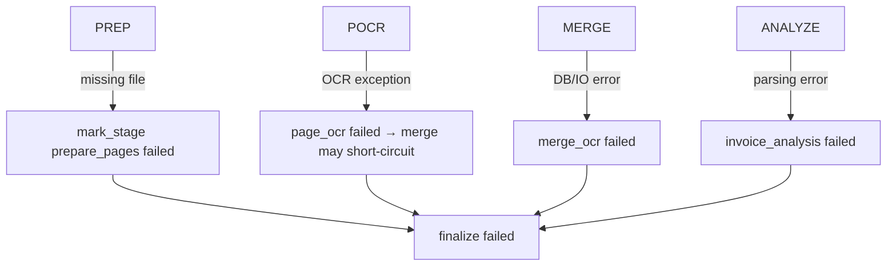

# PDF Split / Invoice Workflow (WF2_PDF_SPLIT)

Version: 2025-11-28  
Scope: Detailed path for multi-page PDFs (non-FirstCard) handled by WF2.

## Entry Point
- `POST /ai/api/ingest/upload` detects `file.kind == "pdf"` → `workflow_key=WF2_PDF_SPLIT` → `dispatch_workflow`.

## Success Path
```mermaid
flowchart TD
  U[Upload PDF] --> WFR[workflow_run WF2_PDF_SPLIT]
  WFR --> PREP[wf2_prepare_pdf_pages\nsplit -> page unified_files]
  PREP --> POCR[wf2_run_page_ocr* (fan-out)]
  POCR --> MERGE[wf2_merge_ocr_results\ncollect OCR text]
  MERGE --> ANALYZE[wf2_run_invoice_analysis\nbuild invoice_documents + invoice_lines]
  ANALYZE --> FIN[wf2_finalize]
  FIN --> WSR[workflow_stage_runs]
```

## Error Path


## Stage Keys
| Stage | Writer | Notes |
| --- | --- | --- |
| `prepare_pages` | `wf2_prepare_pdf_pages` | Splits PDF, creates page `unified_files`. |
| `page_ocr` | `wf2_run_page_ocr` | One per page. |
| `merge_ocr` | `wf2_merge_ocr_results` | Aggregates page OCR text. |
| `invoice_analysis` | `wf2_run_invoice_analysis` | Builds `invoice_documents` + `invoice_lines`. |
| `finalize` | `wf2_finalize` | Sets `workflow_runs.status`. |

## DB Touch Points
- `unified_files`: parent file + derived page files; metadata stored via `create_unified_file`.
- `workflow_stage_runs`: stages above.
- `invoice_documents` / `invoice_lines`: populated in `wf2_run_invoice_analysis`.
- `ai_processing_history`: optional if AI helpers invoked inside invoice analysis (currently minimal).

## References
- `backend/src/services/tasks/ocr_tasks.py` (WF2 functions)
- `backend/src/services/tasks/workflow_tasks.py` (dispatch + finalize)
- `backend/src/services/tasks/utils/invoice_utils.py` (OCR text collection)
