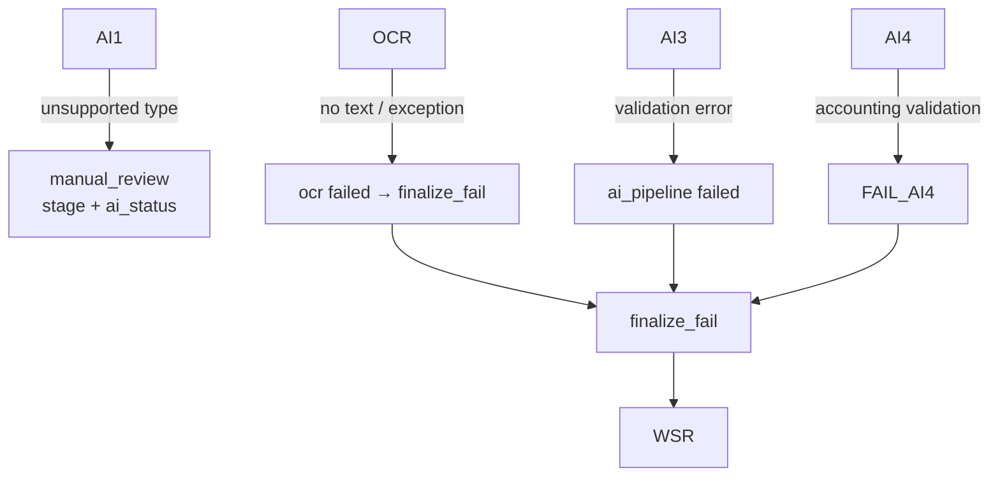

# Receipt Workflow (WF1_RECEIPT)

Version: 2025-11-28  
Scope: Detailed stage map for receipt processing with success/error paths.

## Entry Points
- `POST /ai/api/ingest/upload` (portal) → `backend/src/api/ingest.py`
- FTP fetch via `services/fetch_ftp.py`
- `workflow_key` set to `WF1_RECEIPT` by file detection; run dispatched via `dispatch_workflow()`.

## Success Path (Mermaid)
```mermaid
flowchart TD
  U[Upload/FTP] --> WFR[workflow_run WF1_RECEIPT]
  WFR --> SRC[import stages\nsrc_portal/src_ftp → ingest_store → ingest_wf1]
  SRC --> OCR[wf1_run_ocr\nstage keys: r_ocr + ocr]
  OCR --> AI1[detect_type (AI1)]
  AI1 --> AI2[AI2 expense]
  AI2 --> AI3[AI3 data extraction]
  AI3 --> AI4[AI4 accounting]
  AI4 --> PERSIST[r_persist + set ai_status]
  PERSIST --> QUEUE[r_queue_match]
  QUEUE --> FIN[wf1_finalize\nfinalize_ok + KLAR]
  FIN --> WSR[workflow_stage_runs]
  AI1 --> AIH[ai_processing_history]
  AI2 --> AIH
  AI3 --> AIH
  AI4 --> AIH
```

## Error / Manual Review Path


## Stage Keys & Writers
| Stage key | Written by | Notes |
| --- | --- | --- |
| `src_portal` / `src_ftp` / `ingest_store` / `ingest_wf1` | `begin_import_stage` / `complete_import_stage` in `workflow_base.py` | Boundary markers; set `ai_status=processing`. |
| `r_ocr` | `wf1_run_ocr` (`ocr_tasks.py`) | Also writes stage `ocr`. |
| `detect_type`, `r_ai3`, `r_ai4`, `r_persist`, `r_queue_match` | `_run_ai_pipeline` (`ai_pipeline_tasks.py`) via `begin_import_stage`/`complete_import_stage`. |
| `ai_pipeline` | `wf1_run_ai_pipeline` (`workflow_tasks.py`) | Represents the combined AI chain. |
| `finalize`, `finalize_ok`, `finalize_fail`, `KLAR` | `wf1_finalize` + helpers in `workflow_base.py`. |

## DB Touch Points
- `unified_files`: OCR text stored in `ocr_raw`; `ai_status` updated to `completed` on `finalize_ok`.
- `workflow_runs` / `workflow_stage_runs`: All stages above.
- `ai_processing_history`: Each AI1–AI4 call via `_history` / `log_ai_call`.
- Accounting proposals persisted through `_save_accounting_entries` in `file_management_tasks.py`.

## References
- Tasks: `backend/src/services/tasks/ocr_tasks.py`, `backend/src/services/tasks/ai_pipeline_tasks.py`, `backend/src/services/tasks/workflow_tasks.py`
- Status enums: `backend/src/services/status_constants.py`
- State machine helpers: `backend/src/services/invoice_status.py`
