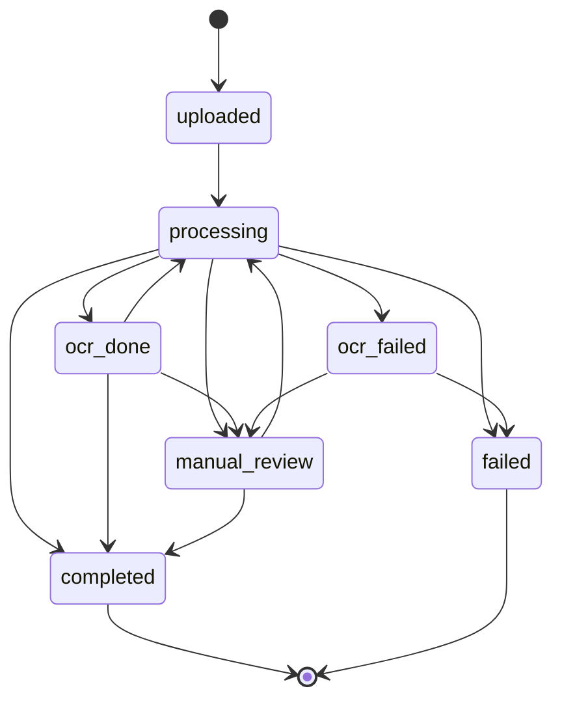
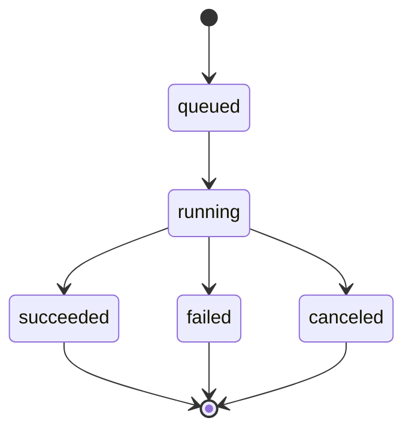
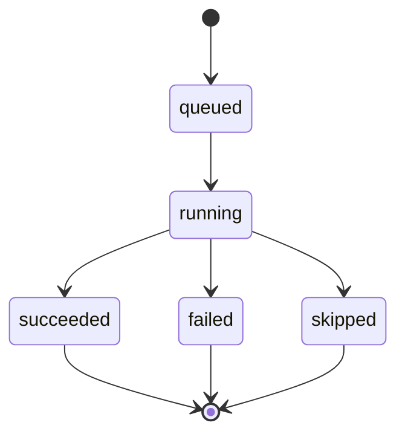
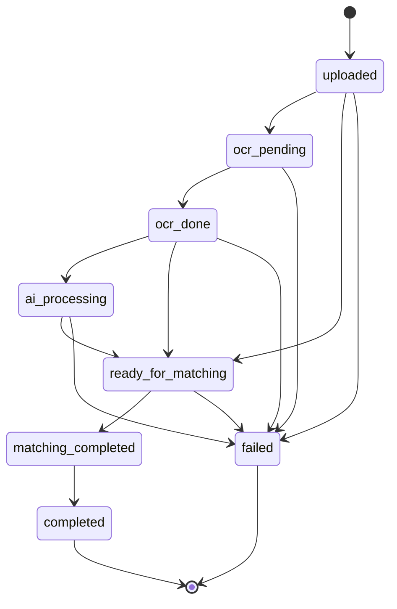
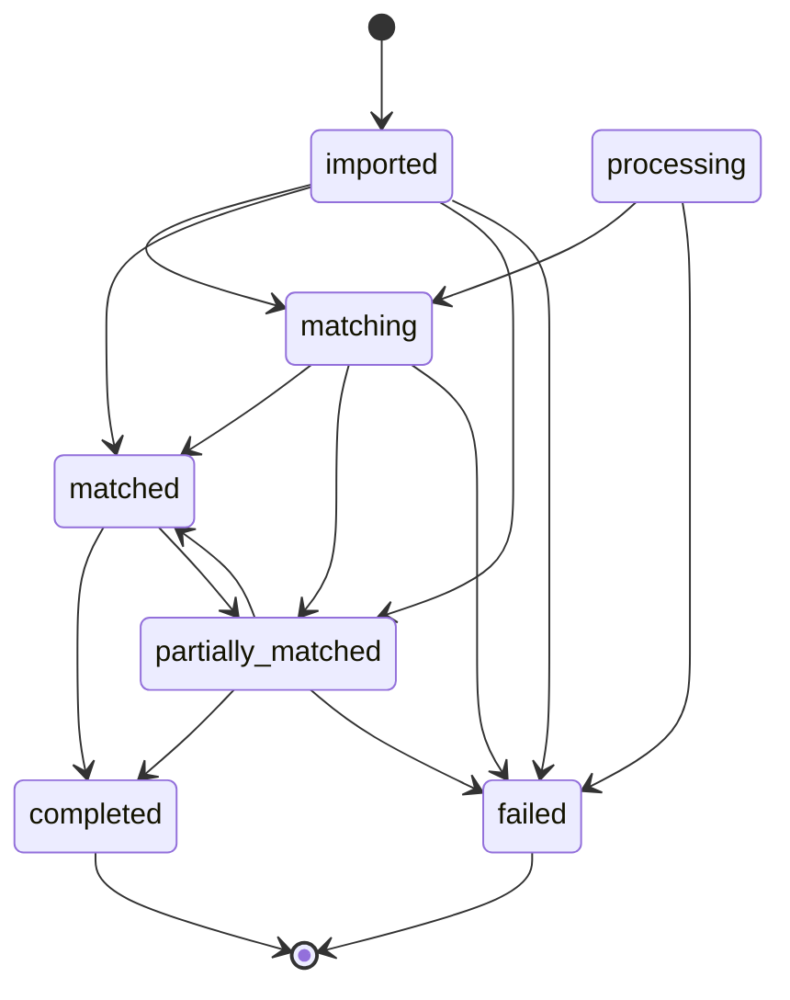
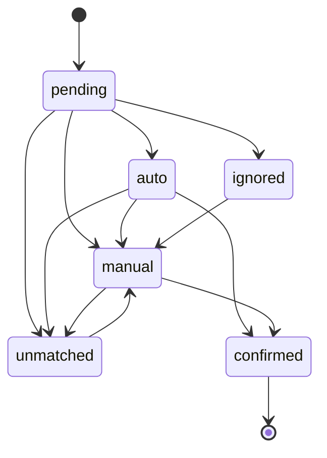

# docs/source_of_truth/30_STATUS_MODEL.md

# Mind – Status Model (Source of Truth)

> This file defines **all** status fields and allowed values used in Mind. If a status value appears in code or database but is not described here, it must be added or removed.
>
> Version: 2025-12-04
> Source: `backend/src/services/status_constants.py`, `backend/src/services/invoice_status.py`, migration `0042_create_workflow_tracking.sql`

## 1. Overview

Mind uses multiple status dimensions to track processing and workflow:

| Status Type | Column/Table | Purpose |
|-------------|--------------|---------|
| AI Status | `unified_files.ai_status` | Overall document processing state |
| Workflow Run Status | `workflow_runs.status` | Workflow execution state |
| Workflow Stage Status | `workflow_stage_runs.status` | Individual stage state |
| Invoice Processing Status | `invoice_documents.processing_status` | Invoice pipeline state |
| Invoice Document Status | `invoice_documents.status` | Business-level invoice state |
| Invoice Line Match Status | `invoice_lines.match_status` | Receipt-to-transaction match state |

## 2. AI Status (`unified_files.ai_status`)

Overall processing state for a document.

**Source:** `backend/src/services/status_constants.py` (AiStatus enum)

| Value | Description | Writers |
|-------|-------------|---------|
| `uploaded` | File created, awaiting processing | `create_unified_file` default |
| `processing` | Active pipeline step running | `begin_import_stage` when source stage starts |
| `ocr_done` | OCR text persisted | OCR tasks |
| `ocr_failed` | OCR failed | OCR error handlers |
| `manual_review` | Sent to manual review queue | `_move_to_manual_review` in AI pipeline |
| `completed` | Workflow finished successfully | `complete_import_stage` when `finalize_ok` |
| `failed` | Fatal error | Error handlers, `finalize_fail` |

### State Diagram



## 3. Workflow Run Status (`workflow_runs.status`)

Execution state for a workflow instance.

**Source:** Migration `0042_create_workflow_tracking.sql`

| Value | Description |
|-------|-------------|
| `queued` | Waiting to start |
| `running` | Currently executing |
| `succeeded` | Completed successfully |
| `failed` | Execution failed |
| `canceled` | Manually canceled |

**Mandatory rule:** After the final stage (`finalize_ok` / `KLAR`) completes successfully, every workflow **must** set `workflow_runs.status = 'succeeded'` and persist `current_stage = 'KLAR'`. No workflow may remain in `running` after successful completion.

### State Diagram



## 4. Workflow Stage Status (`workflow_stage_runs.status`)

State for individual stages within a workflow.

**Source:** Migration `0042_create_workflow_tracking.sql`

| Value | Description |
|-------|-------------|
| `queued` | Stage waiting to execute |
| `running` | Stage currently executing |
| `succeeded` | Stage completed successfully |
| `failed` | Stage execution failed |
| `skipped` | Stage was skipped |

### State Diagram



## 5. Workflow Stage Keys

Stage identifiers used in `workflow_stage_runs.stage_key`.

### 5.1 Source Stages (All Workflows)

| Stage Key | Description | Trigger |
|-----------|-------------|---------|
| `src_portal` | Portal upload source | Process.jsx upload |
| `src_portal_start` | Portal upload started | Auto |
| `src_portal_end` | Portal upload completed | Auto |
| `src_ftp` | FTP fetch source | FTP import |
| `src_ftp_start` | FTP fetch started | Auto |
| `src_ftp_end` | FTP fetch completed | Auto |
| `src_fc` | FirstCard upload source | CompanyCard.jsx upload |
| `src_fc_start` | FC upload started | Auto |
| `src_fc_end` | FC upload completed | Auto |
| `ingest_store` | File storage | Auto after upload |
| `ingest_store_start` | Storage started | Auto |
| `ingest_store_end` | Storage completed | Auto |

### 5.2 WF1_RECEIPT Stages

| Stage Key | Description | AI Model |
|-----------|-------------|----------|
| `ingest_wf1` | Create receipt workflow | - |
| `detect_type` | Document classification | AI1 |
| `r_ocr` | OCR text extraction | PaddleOCR |
| `r_ai3` | Data extraction | AI3 |
| `r_ai4` | Accounting classification | AI4 |
| `r_persist` | Save extracted data | - |
| `r_queue_match` | Queue for matching | - |

### 5.3 WF3_FIRSTCARD_INVOICE Stages

| Stage Key | Description | AI Model |
|-----------|-------------|----------|
| `fc_create` | Create invoice document | - |
| `fc_ocr` | OCR + page extraction | PaddleOCR |
| `fc_parse` | Parse invoice structure | AI6 |
| `fc_is_fc` | Validate FC invoice | Decision |
| `fc_ready` | Ready for matching | - |
| `ai5` | Credit card matching | AI5 |
| `m_found` | Match found decision | Decision |
| `m_link` | Link receipt to line | - |
| `m_unmatched` | Mark as unmatched | - |

### 5.4 Common Final Stages

| Stage Key | Description |
|-----------|-------------|
| `finalize_ok` | Workflow completed successfully |
| `finalize_fail` | Workflow failed |
| `manual_review` | Requires manual review |
| `resume_dispatch` | Resuming paused workflow |
| `restart_dispatch` | Restarting workflow from beginning |
| `KLAR` | Workflow completely finished |

## 6. Invoice Processing Status (`invoice_documents.processing_status`)

Pipeline state for invoice documents.

**Source:** `backend/src/services/invoice_status.py`

| Value | Description |
|-------|-------------|
| `uploaded` | Document uploaded |
| `ocr_pending` | Waiting for OCR |
| `ocr_done` | OCR completed |
| `ai_processing` | AI analysis running |
| `ready_for_matching` | Ready to match transactions |
| `matching_completed` | Matching finished |
| `completed` | Processing finished |
| `failed` | Processing failed |

### State Diagram



## 7. Invoice Document Status (`invoice_documents.status`)

Business-level state for invoice documents.

| Value | Description |
|-------|-------------|
| `imported` | Document imported |
| `processing` | Being processed |
| `matching` | Matching in progress |
| `matched` | All lines matched |
| `partially_matched` | Some lines matched |
| `completed` | Processing complete |
| `failed` | Processing failed |

### State Diagram



## 8. Invoice Line Match Status (`invoice_lines.match_status`)

Match state for individual invoice lines.

| Value | Description |
|-------|-------------|
| `pending` | Not yet matched |
| `auto` | Automatically matched |
| `manual` | Manually matched |
| `confirmed` | Match confirmed by user |
| `unmatched` | No match found |
| `ignored` | Intentionally skipped |

### State Diagram



## 9. Frontend Status Display

The UI displays status via `workflow_stage_status` field.

**Query (in receipts.py):**
```sql
SELECT CONCAT(wsr.stage_key, ' ', wsr.status)
FROM workflow_runs wr
JOIN workflow_stage_runs wsr ON wsr.workflow_run_id = wr.id
WHERE wr.file_id = u.id
ORDER BY wsr.started_at DESC LIMIT 1
```

**Display Priority:**
1. `workflow_stage_status` (from workflow_stage_runs)
2. `status` (unified_files.ai_status)
3. `ai_status` (fallback)

### Swedish Translations (Frontend)

| Backend | Swedish |
|---------|---------|
| `src_portal` | Portal |
| `src_ftp` | FTP |
| `src_fc` | FC-uppladdning |
| `detect_type` | Dokumentklassning |
| `r_ocr` | OCR |
| `r_ai3` | Dataextraktion |
| `r_ai4` | Normalisering |
| `fc_parse` | FC-parsing |
| `ai5` | Kortmatchning |
| `manual_review` | Manuell granskning |
| `finalize_ok` | Slutfor |
| `KLAR` | KLAR |
| `running` | pagaende |
| `succeeded` | klar |
| `failed` | misslyckades |

## 10. Governance

- New status values may not be introduced in code or database without updating this file.
- Deprecated values must be explicitly noted with migration plan.
- All status transitions must be validated by state machine helpers in `invoice_status.py`.

## 11. Orphan Files

An *orphan file* is a row in `unified_files` that has **no** matching row in `workflow_runs` **and** whose `ai_status` is one of the valid starting states:

- `uploaded`
- `processing`
- `ocr_done`
- `ocr_failed`
- `manual_review`

Legacy values such as `queued` or `running` are invalid for `ai_status` and must be migrated or ignored in diagnostics.

## 12. Stalled Condition (UI Diagnostic Only)

A workflow is considered *stalled* for queue/diagnostic purposes when:

- `workflow_runs.status = 'running'`, **and**
- `idle_seconds` (time since `workflow_runs.updated_at`) exceeds the configured `stall_threshold`.

"Stalled" is a **computed UI flag only**. It must never be written to the database.

## 13. Invoice Document Integrity

For every invoice that participates in the invoice state machine, the following must always hold:

- There MUST be exactly one row in `invoice_documents` with `id = invoice_id`.
- All calls to `transition_processing_status` and `transition_document_status` MUST only be made for invoice ids that have a corresponding `invoice_documents` row.

To enforce this, application code MUST call a central helper (e.g. `ensure_invoice_document(...)`) before performing any state transitions. If the helper cannot create or confirm the `invoice_documents` row, the pipeline MUST fail fast and record an error, instead of performing any transitions.

### Illegal transitions from a missing document

If the state machine receives a request to transition an invoice id that does not exist in `invoice_documents`, this MUST be treated as a data integrity issue. The implementation MUST:

- Log an "illegal transition" event with `current=missing`.
- NOT create any new invoice state rows implicitly (unless explicitly defined as a recovery operation).
- Provide a separate operator-level repair procedure in the runbook to fix or recreate the missing `invoice_documents` rows.
