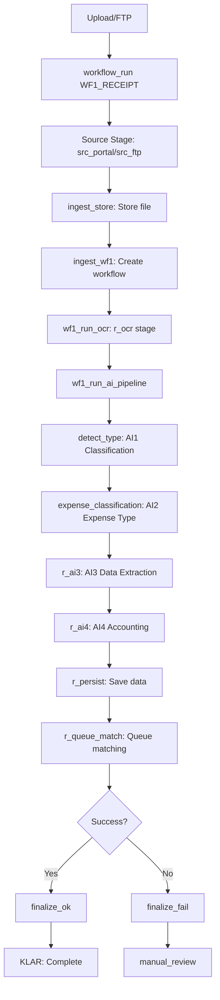
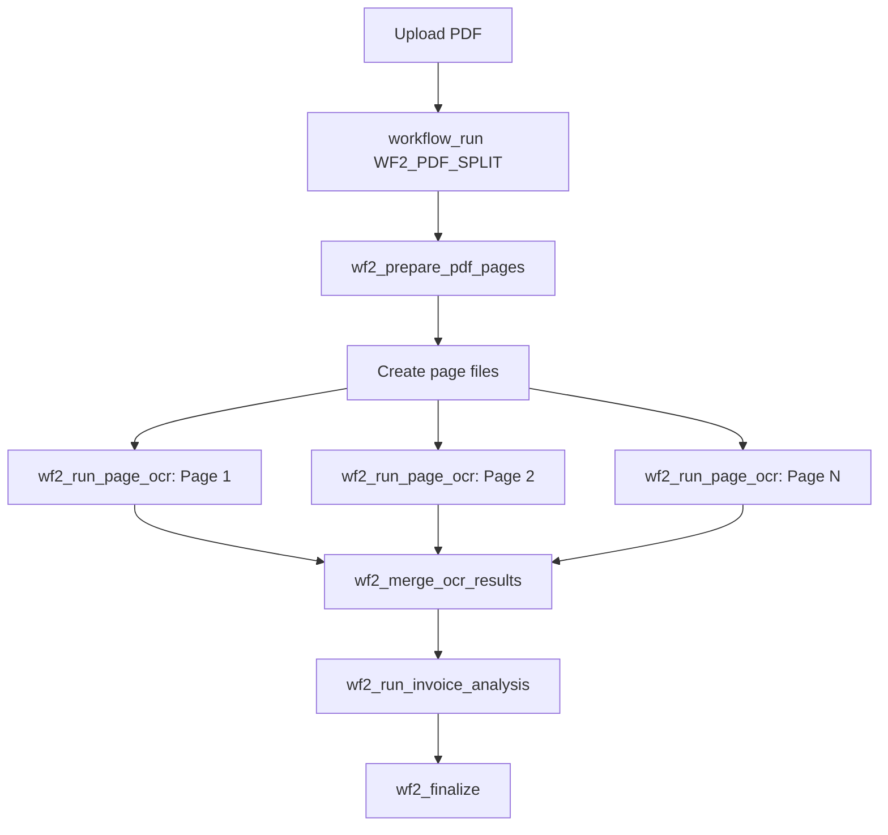
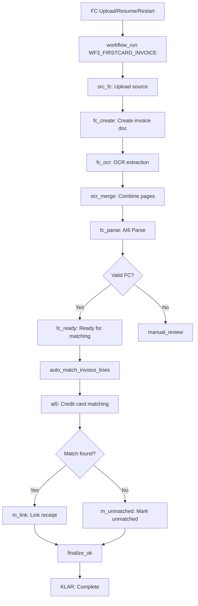

# docs/source_of_truth/50_PIPELINES_AND_JOBS.md

# Mind – Pipelines and Jobs (Source of Truth)

> This file documents all major technical pipelines and scheduled jobs in Mind. It focuses on **what** each pipeline does and **how data flows**.
>
> Version: 2025-12-14.1
> Source: `docs/WORKFLOWS/*.md`, `backend/src/services/tasks/*.py`

## 1. Overview of Workflows

Mind uses three main workflows to process documents:

| Workflow | Key | Purpose | Queue |
|----------|-----|---------|-------|
| Receipt Workflow | `WF1_RECEIPT` | Process receipts through OCR and AI | `wf1` |
| PDF Split Workflow | `WF2_PDF_SPLIT` | Split and process multi-page PDFs | `wf2` |
| FirstCard Workflow | `WF3_FIRSTCARD_INVOICE` | Process credit card statements | `default` |

Additionally, there is a **ManualMatch** UI flow for manual receipt-to-transaction matching.

## 2. WF1_RECEIPT – Receipt Workflow

### 2.1 Trigger

- `POST /ingest/upload` (image/PDF upload via portal)
- FTP fetch via `POST /ingest/fetch-ftp`
- `unified_files.workflow_type = 'receipt'`

### 2.2 Flow Diagram



### 2.3 Stage Details

> **Note:** AI2 runs *inside* `wf1_run_ai_pipeline` (not as a separate Celery task). It writes `unified_files.expense_type` and the value is included in the AI3 extraction context.

| Stage | Task/Function | Description | Output |
|-------|---------------|-------------|--------|
| `src_portal` | `ingest.py` | Portal file upload | File stored |
| `src_ftp` | `fetch_ftp.py` | FTP file fetch | File stored |
| `ingest_store` | `ingest.py` | Store file metadata | `unified_files` row |
| `ingest_wf1` | `ingest.py` | Create workflow run | `workflow_runs` row |
| `r_ocr` | `wf1_run_ocr()` | OCR text extraction | `unified_files.ocr_raw` |
| `detect_type` | `classify_and_route_receipt_v3()` | AI1: Document classification | Document type |
| `expense_classification` | `classify_expense_internal()` | AI2: Expense type detection (personal/corporate) | `unified_files.expense_type` |
| `r_ai3` | `extract_receipt_data_ai3()` | AI3: Data extraction | Amounts, dates, merchant |
| `r_ai4` | `normalize_receipt_data_ai4()` | AI4: Accounting classification | Account codes, VAT |
| `r_persist` | Implicit | Save structured data | `unified_files` + `receipt_items` |
| `r_queue_match` | - | Queue for AI5 matching | - |
| `finalize_ok` | `wf1_finalize()` | Mark success | `ai_status=completed` |
| `KLAR` | - | Final state | - |

### 2.4 Key Code Files

- `backend/src/api/ingest.py` – Upload and ingestion
- `backend/src/services/tasks/ocr_tasks.py` – OCR processing
- `backend/src/services/tasks/ai_pipeline_tasks.py` – AI pipeline
- `backend/src/services/tasks/workflow_tasks.py` – Workflow orchestration

## 3. WF2_PDF_SPLIT – PDF Split Workflow

### 3.1 Trigger

- `POST /ingest/upload` (multi-page PDF)
- Document detected as requiring page-by-page processing

### 3.2 Flow Diagram



### 3.3 Stage Details

| Stage | Task/Function | Description | Output |
|-------|---------------|-------------|--------|
| `dispatch` | - | Start workflow | `workflow_runs` row |
| `prepare_pages` | `wf2_prepare_pdf_pages()` | Split PDF into pages | Page `unified_files` |
| `page_ocr` | `wf2_run_page_ocr()` | OCR each page | Per-page OCR text |
| `merge_ocr` | `wf2_merge_ocr_results()` | Combine OCR results | Merged text |
| `invoice_analysis` | `wf2_run_invoice_analysis()` | Analyze content | `invoice_documents` |
| `finalize` | `wf2_finalize()` | Complete workflow | - |

### 3.4 Key Code Files

- `backend/src/services/tasks/ocr_tasks.py`
- `backend/src/services/tasks/workflow_tasks.py`

## 4. WF3_FIRSTCARD_INVOICE – Credit Card Workflow

### 4.1 Trigger

- `POST /reconciliation/firstcard/upload-invoice`
- Resume: `POST /reconciliation/firstcard/statements/{id}/resume`
- Restart: `POST /reconciliation/firstcard/statements/{id}/restart`
- `unified_files.workflow_type = 'creditcard_invoice'`

### 4.2 Flow Diagram



### 4.3 Stage Details

| Stage | Task/Function | Description | Output |
|-------|---------------|-------------|--------|
| `src_fc` | `reconciliation_firstcard.py` | FC upload | File stored |
| `fc_create` | - | Create invoice document | `invoice_documents` row |
| `fc_ocr` | `process_credit_card_statement()` | OCR extraction | OCR text |
| `ocr_merge` | - | Merge multi-page OCR | Combined text |
| `fc_parse` | `parse_credit_card_invoice_ai6()` | AI6: Parse statement | `creditcard_invoices_main` + `_items` |
| `fc_is_fc` | - | Validate FC invoice | Decision |
| `fc_ready` | - | Mark ready for matching | `processing_status=ready_for_matching` |
| `ai5` | AI5 matching | Auto-match transactions | Match candidates |
| `m_found` | - | Match found decision | - |
| `m_link` | - | Link receipt to line | `receipt_id` in line |
| `m_unmatched` | - | Mark unmatched | `match_status=unmatched` |
| `finalize_ok` | - | Complete workflow | `ai_status=completed` |
| `KLAR` | - | Final state | - |

### 4.4 Key Code Files

- `backend/src/api/reconciliation_firstcard.py`
- `backend/src/services/workflow_coordinator.py`
- `backend/src/services/tasks/workflow_tasks.py`
- `backend/src/services/tasks/creditcard_tasks.py`
- `backend/src/services/ai_service.py`

## 5. ManualMatch – UI Workflow

### 5.1 Trigger

- User navigates to ManualMatch page
- Selects credit card statement
- Manually matches transactions to receipts

### 5.2 Flow Diagram

```mermaid
flowchart TD
    User --> List[GET /reconciliation/firstcard/statements]
    List --> Select[Select statement]
    Select --> Detail[GET /reconciliation/firstcard/statements/{id}]
    Detail --> Lines[GET /reconciliation/firstcard/statements/{id}/lines]
    Detail --> Receipts[GET /receipts?creditcard_invoice_id=...]
    Lines --> Match[User selects receipt for line]
    Match --> POST[POST /reconciliation/firstcard/match]
    POST --> Confirm[POST /reconciliation/firstcard/statements/{id}/confirm]
```

### 5.3 UI Components

- `main-system/app-frontend/src/ui/pages/ManualMatch.jsx`
- Supports pagination, filtering, and match confirmation

## 6. Celery Queue Configuration

### 6.1 Queues

| Queue | Workers | Purpose |
|-------|---------|---------|
| `default` | `celery-worker` | General tasks, WF3 |
| `wf1` | `celery-worker-wf1` | Receipt workflow tasks |
| `wf2` | `celery-worker-wf2` | PDF split workflow tasks |

### 6.2 Docker Services

```yaml
celery-worker:        # default queue
celery-worker-wf1:    # wf1 queue
celery-worker-wf2:    # wf2 queue
```

## 7. Task Inventory

### 7.1 Active Tasks

| Task | Queue | Workflow | Description |
|------|-------|----------|-------------|
| `wf1_run_ocr` | wf1 | WF1 | Receipt OCR |
| `wf1_run_ai_pipeline` | wf1 | WF1 | AI1-AI4 pipeline (includes AI2 expense type) |
| `wf1_finalize` | wf1 | WF1 | Complete workflow |
| `wf2_prepare_pdf_pages` | wf2 | WF2 | Split PDF |
| `wf2_run_page_ocr` | wf2 | WF2 | Per-page OCR |
| `wf2_merge_ocr_results` | wf2 | WF2 | Merge OCR |
| `wf2_run_invoice_analysis` | wf2 | WF2 | Analyze invoice |
| `wf2_finalize` | wf2 | WF2 | Complete workflow |
| `wf3_firstcard_invoice` | default | WF3 | FC processing |
| `process_credit_card_statement` | default | WF3 | FC OCR + parse |
| `auto_match_invoice_lines` | default | WF3 | Auto-matching |

### 7.2 Task Location

- `backend/src/services/tasks/ocr_tasks.py` – OCR tasks
- `backend/src/services/tasks/ai_pipeline_tasks.py` – AI tasks
- `backend/src/services/tasks/workflow_tasks.py` – Workflow orchestration
- `backend/src/services/tasks/creditcard_tasks.py` – Credit card tasks

## 8. Resume and Restart

### 8.1 Resume Workflow

Resume continues from where the workflow stopped.

**Endpoints:**
- `POST /ingest/process/{id}/resume` (WF1)
- `POST /reconciliation/firstcard/statements/{id}/resume` (WF3)

**Stage logged:** `resume_dispatch`

### 8.2 Restart Workflow

Restart begins the entire workflow from the beginning.

**Endpoint:**
- `POST /reconciliation/firstcard/statements/{id}/restart` (WF3 only)

**Stage logged:** `restart_dispatch`

## 9. Error Handling

### 9.1 Stage Failure

When a stage fails:
1. `workflow_stage_runs.status` set to `failed`
2. `workflow_stage_runs.message` contains error details
3. `workflow_runs.status` may be set to `failed`
4. `unified_files.ai_status` set to `failed` or `manual_review`

### 9.2 Retry Logic

- OCR failures can be retried via resume
- AI failures can trigger manual_review
- Critical failures require restart

## 10. Queue View (Diagnostics)

The queue view must present only active or actionable items:

1. **Active workflows:** `workflow_runs.status` in `running` or `queued`.
2. **Orphan files:** Rows in `unified_files` with no matching `workflow_runs` row and `ai_status` in `uploaded`, `processing`, `ocr_done`, `ocr_failed`, `manual_review`.
3. **Stalled workflows:** `workflow_runs.status = 'running'` where `idle_seconds > stall_threshold` (computed from `workflow_runs.updated_at`).

Completed (`succeeded`) and permanently failed (`failed`) workflow runs must **not** appear in the queue; they belong to the workflow history view.

## 11. AI Provider Failures (e.g. OpenAI 500)

When an external AI provider returns a 5xx error or equivalent hard failure during invoice processing:

- The pipeline MUST NOT transition the invoice to `AI_PROCESSING` or any later processing status after the failure.
- Instead, the invoice MUST transition to a failure state using the standard helper (e.g. `_fail_invoice_processing(...)`), which sets:
  - `invoice_documents.processing_status = FAILED`
  - `invoice_documents.status = FAILED` or `MANUAL_REVIEW` (according to product rules)
- The failure MUST be logged in the invoice history with enough detail to support later reprocessing.
- Reprocessing (via resume or batch-resume) is allowed and MUST perform a fresh AI call and a new state-transition sequence.

## 12. Monitoring

### 11.1 Diagnostic Views

```sql
-- Workflow overview
SELECT * FROM v_workflow_overview WHERE file_id = 'xxx';

-- Workflow stages
SELECT * FROM v_workflow_stages WHERE workflow_run_id = 123;

-- Latest stage per file
SELECT CONCAT(stage_key, ' ', status) as current_status
FROM workflow_stage_runs wsr
JOIN workflow_runs wr ON wr.id = wsr.workflow_run_id
WHERE wr.file_id = 'xxx'
ORDER BY wsr.started_at DESC LIMIT 1;
```

### 11.2 Health Indicators

- Check `workflow_runs` for stuck `running` status
- Check `workflow_stage_runs` for `failed` status
- Monitor Celery queues for task backlog

## 13. Governance

- New workflows must be documented here before implementation
- New stages must be added to section 2-4 before deployment
- Task changes require update to section 7
