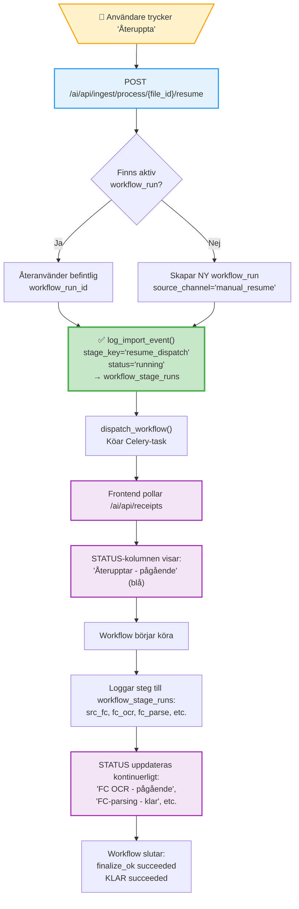

# Återuppta-funktionalitet i Mind2

**Datum:** 2025-11-08
**Version:** 1.0

## Översikt

Detta dokument beskriver hur "Återuppta"-funktionaliteten fungerar i Mind2-systemet, inklusive alla statusar som visas i frontend och hur workflow_stage_runs synkroniseras med UI:t.

---

## 1. ÅTERUPPTA I PROCESS.JSX (KVITTON OCH FAKTUROR)

### Frontend

**Fil:** `main-system/app-frontend/src/ui/pages/Process.jsx`
**Knapp:** "Återuppta"-knapp i Status-kolumnen (rad 2111-2122)

**Funktion:** `handleResume(fileId)` (rad 1611-1656)

```javascript
const handleResume = async (fileId) => {
  const res = await api.fetch(`/ai/api/ingest/process/${fileId}/resume`, {
    method: 'POST',
  });

  if (res.ok && data.queued) {
    // Refreshar lista omedelbart + efter 5 sek
    await loadReceipts(true);
    setTimeout(() => loadReceipts(true), 5000);
  }
}
```

### Backend

**Fil:** `backend/src/api/ingest.py`
**Endpoint:** `POST /ai/api/ingest/process/<file_id>/resume` (rad 260-389)

**Flöde:**

1. **Hämtar fil från unified_files:**
   ```python
   SELECT id, content_hash, file_type, workflow_type, other_data, ai_status
   FROM unified_files
   WHERE id = %s AND deleted_at IS NULL
   ```

2. **Bestämmer workflow_key:**
   - `workflow_type='creditcard_invoice'` → `WF3_FIRSTCARD_INVOICE`
   - Annat → `WF1_RECEIPT`

3. **Kollar om aktiv workflow_run redan finns:**
   ```python
   existing_run_id = get_active_workflow_run(file_id, workflow_key)
   if existing_run_id:
       workflow_run_id = existing_run_id  # Återanvänder!
   else:
       workflow_run_id = create_workflow_run(
           workflow_key=workflow_key,
           source_channel="manual_resume",
           file_id=file_id,
       )
       set_ai_status(file_id, "queued")
   ```

4. **Loggar resume_dispatch stage (NY FIX!):**
   ```python
   log_import_event(
       workflow_run_id,
       "resume_dispatch",
       status="running",
       message=f"Återupptar bearbetning (tidigare status: {current_status})",
   )
   ```

5. **Dispatchar workflow:**
   ```python
   dispatch_workflow(workflow_run_id)
   set_ai_status(file_id, "processing")
   ```

**Vad som händer i UI:**
- STATUS-kolumnen visar: **"Återupptar - pågående"** (blå)
- När workflow börjar köra → STATUS uppdateras till aktuellt steg

---

## 2. ÅTERUPPTA/OMSTARTA I COMPANYCARD.JSX (FIRSTCARD-FAKTUROR)

### Frontend

**Fil:** `main-system/app-frontend/src/ui/pages/CompanyCard.jsx`
**Knapp:** "Återuppta fakturaimport"-knapp (rad 1707)

**Funktion:** `handleResumeOrRestartInvoice(statementId, processingStatus)` (rad 741-780)

```javascript
const handleResumeOrRestartInvoice = async (statementId, processingStatus) => {
  // Bestämmer action baserat på processing_status
  const isCompleted = processingStatus === 'matching_completed' ||
                      processingStatus === 'ready_for_matching'
  const action = isCompleted ? 'restart' : 'resume'

  const response = await api.fetch(
    `/ai/api/reconciliation/firstcard/statements/${statementId}/${action}`,
    { method: 'POST' }
  )
}
```

### Backend - RESUME

**Fil:** `backend/src/api/reconciliation_firstcard.py`
**Endpoint:** `POST /reconciliation/firstcard/statements/<sid>/resume` (rad 2138-2207)

**Flöde:**

1. Hittar senaste workflow_run för statementId
2. Uppdaterar status till 'matching'
3. **Loggar resume_dispatch stage (NY FIX!):**
   ```python
   log_import_event(
       workflow_run_id,
       "resume_dispatch",
       status="running",
       message=f"Återupptar matchning (tidigare status: {status})",
   )
   ```
4. Dispatchar workflow (fortsätter från där den stannade)

### Backend - RESTART

**Fil:** `backend/src/api/reconciliation_firstcard.py`
**Endpoint:** `POST /reconciliation/firstcard/statements/<sid>/restart` (rad 2202-2285)

**Flöde:**

1. Skapar NY workflow_run med `source_channel="kortmatchning_restart"`
2. **Loggar restart_dispatch stage (NY FIX!):**
   ```python
   log_import_event(
       workflow_run_id,
       "restart_dispatch",
       status="running",
       message="Omstartar fakturaimport från början",
   )
   ```
3. Startar OM HELA WF3-flödet från början (OCR → AI6 → AI5)

**SKILLNADEN:**
- **RESUME:** Fortsätter från där workflow stannade (bara matchning)
- **RESTART:** Börjar om från början (hela flödet)

---

## 3. SVENSKA STATUSAR SOM VISAS I FRONTEND

### Backend: Vad som skickas

**SQL-query** (`backend/src/api/receipts.py` rad 953-957):
```sql
(SELECT CONCAT(wsr.stage_key, ' ', wsr.status)
 FROM workflow_runs wr
 JOIN workflow_stage_runs wsr ON wsr.workflow_run_id = wr.id
 WHERE wr.file_id = u.id
 ORDER BY wsr.started_at DESC LIMIT 1) as workflow_stage_status
```

**Format:** `"stage_key status"` (t.ex. `"fc_parse running"`, `"finalize_ok succeeded"`)

### Frontend: Översättningar

**Fil:** `main-system/app-frontend/src/ui/pages/Process.jsx` (rad 135-181)

#### Stage Keys → Svenska

| Backend stage_key | Svenska |
|------------------|---------|
| `src_portal` | Portal |
| `src_portal_start` | Portal start |
| `src_portal_end` | Portal klar |
| `src_ftp` | FTP |
| `src_ftp_start` | FTP start |
| `src_ftp_end` | FTP klar |
| `src_fc` | FC-uppladdning |
| `src_fc_start` | FC start |
| `src_fc_end` | FC klar |
| `ingest_store` | Lagrar fil |
| `ingest_store_start` | Lagrar fil start |
| `ingest_store_end` | Lagrar fil klar |
| `ingest_wf1` | Startar kvittoflöde |
| `fc_create` | Skapar FC-faktura |
| `fc_ocr` | FC OCR |
| `fc_parse` | FC-parsing |
| `fc_ready` | FC redo för matchning |
| `detect_type` | Dokumentklassning |
| `r_ocr` | OCR |
| `r_ai3` | Dataextraktion |
| `r_ai4` | Normalisering |
| `r_persist` | Sparar data |
| `r_queue_match` | Köar matchning |
| `ai5` | Kortmatchning |
| `m_link` | Länka kvitto |
| `m_unmatched` | Omatchad |
| `finalize_ok` | Slutför |
| `finalize_fail` | Slutför (fel) |
| `manual_review` | Manuell granskning |
| `resume_dispatch` | **Återupptar** ⭐ NY |
| `restart_dispatch` | **Omstartar** ⭐ NY |
| `KLAR` | KLAR |

#### Status → Svenska

| Backend status | Svenska |
|---------------|---------|
| `running` | pågående |
| `succeeded` | klar |
| `failed` | misslyckades |
| `queued` | i kö |
| `skipped` | hoppades över |

### Exempel på vad som visas i UI

| Backend returnerar | Frontend visar |
|-------------------|----------------|
| `src_fc running` | **FC-uppladdning - pågående** (blå) |
| `fc_parse succeeded` | **FC-parsing - klar** (grön) |
| `resume_dispatch running` | **Återupptar - pågående** (blå) ⭐ |
| `restart_dispatch running` | **Omstartar - pågående** (blå) ⭐ |
| `finalize_ok succeeded` | **Slutför - klar** (grön) |
| `KLAR succeeded` | **KLAR - klar** (grön) |

---

## 4. PROBLEMET SOM FIXADES

### Innan fix:

1. Användaren trycker "Återuppta"
2. Backend sätter `ai_status="processing"`
3. Frontend frågar efter `workflow_stage_status`
4. **MEN workflow har inte börjat logga stages än!**
5. `workflow_stage_status` är fortfarande gammal
6. ❌ **STATUS-kolumnen förändras INTE**

### Efter fix:

1. Användaren trycker "Återuppta"
2. Backend loggar **omedelbart** `resume_dispatch running` till `workflow_stage_runs`
3. Frontend frågar efter `workflow_stage_status`
4. Får tillbaka `"resume_dispatch running"`
5. ✅ **STATUS-kolumnen visar: "Återupptar - pågående"**
6. När workflow börjar köra → STATUS uppdateras till nästa steg

---

## 5. FLÖDESDIAGRAM MED ÅTERUPPTA



---

## 6. TEKNISKA DETALJER

### Databas-tabeller involverade

1. **unified_files**
   - Kolumn: `ai_status` (sätts till "processing" vid resume)
   - Används: Fallback om workflow_stage_status saknas

2. **workflow_runs**
   - Kolumn: `status` ('running', 'succeeded', 'failed')
   - Används: Spårar workflow-nivå status

3. **workflow_stage_runs** ⭐ VIKTIG
   - Kolumner: `workflow_run_id`, `stage_key`, `status`, `started_at`, `finished_at`, `message`
   - Används: **DETTA ÄR VAD FRONTEND VISAR**
   - Exempel:
     ```
     stage_key='resume_dispatch', status='running'
     stage_key='fc_ocr', status='running'
     stage_key='fc_parse', status='succeeded'
     stage_key='KLAR', status='succeeded'
     ```

### Hur frontend hämtar status

**API-anrop:** `GET /ai/api/receipts`

**SQL-query** returnerar:
```json
{
  "id": "file-123",
  "status": "processing",              // från unified_files.ai_status
  "ai_status": "processing",            // samma
  "workflow_stage_status": "fc_parse running"  // ⭐ från workflow_stage_runs
}
```

**Process.jsx** visar:
```javascript
<StatusBadge status={receipt.workflow_stage_status || receipt.status || receipt.ai_status} />
```

Prioritet:
1. `workflow_stage_status` (senaste stage från workflow_stage_runs) ⭐ FÖRST
2. `status` (unified_files.ai_status) - fallback
3. `ai_status` (samma som status) - fallback

---

## 7. SAMMANFATTNING AV ÄNDRINGAR

### Backend-ändringar

**Fil: `backend/src/api/ingest.py`** (rad 347-354)
- ✅ Lagt till `log_import_event("resume_dispatch", "running")` när återuppta triggas
- Detta loggar omedelbart till `workflow_stage_runs` så frontend ser förändringen

**Fil: `backend/src/api/reconciliation_firstcard.py`** (rad 2178-2185, 2248-2255)
- ✅ Lagt till `log_import_event("resume_dispatch", "running")` för resume
- ✅ Lagt till `log_import_event("restart_dispatch", "running")` för restart

### Frontend-ändringar

**Fil: `main-system/app-frontend/src/ui/pages/Process.jsx`** (rad 175-176)
- ✅ Lagt till översättning: `resume_dispatch: 'Återupptar'`
- ✅ Lagt till översättning: `restart_dispatch: 'Omstartar'`

### Resultat

**Innan:**
- Tryck på "Återuppta" → Ingen synlig förändring i STATUS-kolumnen
- Användaren vet inte om något händer

**Efter:**
- Tryck på "Återuppta" → STATUS visar omedelbart **"Återupptar - pågående"** (blå)
- Användaren ser att systemet reagerar
- När workflow börjar köra → STATUS uppdateras till aktuellt steg

---

## 8. DEBUGGING OCH VERIFIERING

### Kolla status i databasen

```sql
-- Visa senaste workflow stages för en fil
SELECT wsr.stage_key, wsr.status, wsr.message, wsr.started_at
FROM workflow_runs wr
JOIN workflow_stage_runs wsr ON wsr.workflow_run_id = wr.id
WHERE wr.file_id = 'DIN_FILE_ID'
ORDER BY wsr.started_at DESC
LIMIT 10;
```

**Förväntat resultat efter återuppta:**
```
stage_key         | status   | message                              | started_at
------------------|----------|--------------------------------------|------------------
resume_dispatch   | running  | Återupptar bearbetning (tidigare...) | 2025-11-08 14:30:00
KLAR             | succeeded| WF3 slutförd                         | 2025-11-08 14:25:00
finalize_ok_end  | succeeded|                                      | 2025-11-08 14:25:00
...
```

### Kolla i frontend

1. Öppna Process.jsx
2. Tryck "Återuppta" på en fil
3. STATUS-kolumnen ska OME DELBART visa: **"Återupptar - pågående"**
4. Efter några sekunder → nästa steg visas

---

**Dokumentation skapad:** 2025-11-08
**Av:** Claude Code (Anthropic)
**Version:** 1.0
